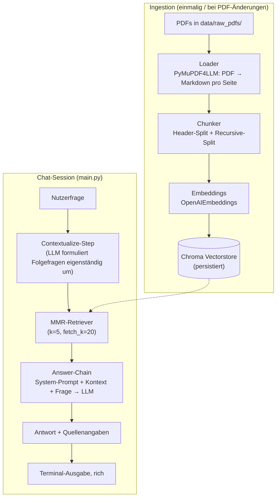

# Abaqus Handbuch-Chatbot — Technische Dokumentation

**Modul:** NLP-Studienmodul · **Typ:** Retrieval-Augmented-Generation-System (RAG)
**Domäne:** Bedienungsfragen zur FEA-Software Abaqus, beantwortet auf Basis der
offiziellen PDF-Handbücher

---

## Inhaltsverzeichnis

1. [Zielsetzung](#1-zielsetzung)
2. [Systemüberblick](#2-systemüberblick)
3. [Tech-Stack & Designentscheidungen](#3-tech-stack--designentscheidungen)
4. [Ingestion-Pipeline](#4-ingestion-pipeline)
5. [RAG-Engine](#5-rag-engine)
6. [Terminal-Chat-Interface](#6-terminal-chat-interface)
7. [Konfiguration](#7-konfiguration)
8. [Projektstruktur](#8-projektstruktur)
9. [Setup & Nutzung](#9-setup--nutzung)
10. [Tests](#10-tests)
11. [Verifikationsergebnisse](#11-verifikationsergebnisse)
12. [Frontend, LLM- und Parser-Vergleich](#12-frontend-llm--und-parser-vergleich)
13. [Bekannte Grenzen & mögliche Erweiterungen](#13-bekannte-grenzen--mögliche-erweiterungen)

---

## 1. Zielsetzung

Der Chatbot soll Nutzer:innen bei der Bedienung der FEA-Software **Abaqus**
unterstützen, indem er Fragen in natürlicher Sprache auf Basis der offiziellen
PDF-Handbücher beantwortet — mit **Seiten-genauer Quellenangabe**, damit die
Antwort im Original nachgeschlagen werden kann, und mit **Gesprächsgedächtnis**
für Folgefragen ("Und wie mache ich das für Modell X?").

Anders als ein generisches LLM darf der Bot **nur** auf Basis des tatsächlich
im Handbuch gefundenen Kontexts antworten — Halluzinationen werden durch einen
strikten System-Prompt und expliziten "Ich weiß es nicht"-Fallback minimiert.

## 2. Systemüberblick

Das System besteht aus zwei getrennten Phasen:



Beide Phasen sind vollständig entkoppelt: Die Ingestion läuft einmalig über
`scripts/ingest.py`, die Chat-Session lädt den fertigen Vectorstore lediglich
über `scripts`-unabhängiges `main.py`.

## 3. Tech-Stack & Designentscheidungen

| Bereich | Wahl | Begründung |
|---|---|---|
| **Vektor-DB** | Chroma (lokal, persistent, SQLite-basiert) | Kein Serverbetrieb nötig, native LangChain-Integration, unterstützt Metadaten-Filter. FAISS bietet keine native Metadaten-Filterung; Qdrant/LanceDB wären für den Umfang dieses Projekts unnötiger Infra-Overhead. |
| **PDF-Parser** | PyMuPDF4LLM (`pymupdf4llm.to_markdown`) | Konvertiert jede Seite in Markdown und erhält dabei Überschriften-Hierarchie und Tabellen (als Markdown-Tabellen). Das ist entscheidend für Handbücher: Kapitel-/Abschnittsstruktur bleibt maschinenlesbar erhalten, statt in einem einzigen Fließtext verloren zu gehen. Fällt bei Bild-/Scan-Seiten automatisch auf Tesseract-OCR zurück. |
| **Chunking** | Hybrid: `MarkdownHeaderTextSplitter` + `RecursiveCharacterTextSplitter` als Fallback | Abschnitte (`#`/`##`/`###`) bleiben zusammenhängend, statt an willkürlichen Zeichengrenzen zu zerreißen. Nur Abschnitte, die trotzdem länger als `CHUNK_SIZE` sind, werden zusätzlich rekursiv gesplittet. Reines Embedding-basiertes "Semantic Chunking" wurde ursprünglich als unnötig teuer verworfen — mittlerweile empirisch gegen 5 weitere Chunking-Strategien geprüft, siehe [`docs/CHUNKING.md`](CHUNKING.md). |
| **Embeddings** | `text-embedding-3-small` | Guter Kompromiss aus Kosten und Retrieval-Qualität für technischen Text; empirisch gegen `-3-large` und `ada-002` geprüft, siehe [`docs/EMBEDDING.md`](EMBEDDING.md). |
| **LLM** | `gpt-4o-mini` (konfigurierbar) | Günstig, schnell, für Handbuch-Q&A ausreichend präzise; austauschbar über `.env`. |
| **RAG-Orchestrierung** | Reine [LCEL](https://python.langchain.com/docs/concepts/lcel/)-Runnables (kein `langchain.chains`) | Die installierte LangChain-Version (≥1.0) hat das klassische `langchain.chains`-Modul — inkl. `create_retrieval_chain` / `create_history_aware_retriever` — vollständig entfernt und die Bibliothek auf einen Agent-zentrierten Ansatz (`langchain.agents.create_agent`) umgebaut. Statt eines veralteten Compat-Layers (`langchain-classic`) wird die Kette hier transparent aus einzelnen `Runnable`-Bausteinen zusammengesetzt — näher am eigentlichen LCEL-Paradigma und mit voller Kontrolle über das Source-Tracking. |
| **Retrieval-Strategie** | MMR (Max Marginal Relevance), `k=5`, `fetch_k=20` | Reduziert redundante Chunks, die aus derselben Seite/demselben Abschnitt stammen, zugunsten thematisch diverserer Kontextabdeckung. |
| **Conversation Memory** | Einfache Nachrichtenliste (`list[BaseMessage]`) innerhalb der CLI-Session | Für ein Single-User-Terminal-Tool ausreichend; der für Multi-User-/Webanwendungen gedachte `RunnableWithMessageHistory`-Session-Store wäre hier unnötige Komplexität. |
| **Config-Management** | `pydantic-settings` | Typsichere, validierte Konfiguration aus `.env`; verhindert stille Fehlkonfiguration (z. B. fehlender API-Key wird sofort beim Start als Validierungsfehler sichtbar, nicht erst beim ersten API-Call). |
| **Terminal-UI** | `rich` | Markdown-Rendering der Antworten, Spinner während des Retrievals, farbige/strukturierte Ausgabe ohne zusätzliches Web-Framework. |

### 3.1 Evaluierte Alternative: Docling, pdfplumber & Unstructured als PDF-Parser

Neben PyMuPDF4LLM wurden drei weitere gängige Parser-Kandidaten
(**Docling**, **pdfplumber**, **Unstructured**, jeweils inkl. der
tabellenfokussierten Modi) empirisch am selben Seitenausschnitt getestet.
Ergebnis: PyMuPDF4LLM war sowohl **bis zu 127× schneller** als auch bei den
getesteten linienlosen Tabellen **inhaltlich präziser** als alle drei
Alternativen — Docling und Unstructured `hi_res` verloren dabei sogar
Tabellenstruktur bzw. lieferten OCR-verstümmelten Zellinhalt. Vollständiger
Vergleich mit Messwerten und Beispiel-Outputs:
[`docs/PARSER.md`](PARSER.md).

## 4. Ingestion-Pipeline

Pfad: `src/rag_manual_bot/ingestion/`

### 4.1 Loader (`loader.py`)

```python
def load_pdf(pdf_path: Path) -> list[PageDocument]:
    pages = pymupdf4llm.to_markdown(str(pdf_path), page_chunks=True, show_progress=False)
    doc = pymupdf.open(str(pdf_path))
    try:
        result = []
        for page in pages:
            if not page["text"].strip():
                continue
            pdf_index = page["metadata"]["page_number"] - 1  # 0-basiert für PyMuPDF
            printed_label = doc[pdf_index].get_label() or str(page["metadata"]["page_number"])
            result.append(
                PageDocument(text=page["text"], source_file=pdf_path.name, page_number=printed_label)
            )
        return result
    finally:
        doc.close()
```

- `page_chunks=True` liefert pro PDF-Seite ein Dict mit Markdown-Text **und**
  Metadaten (u. a. `page_number`) — allerdings ist dieser Wert nur die
  **sequenzielle Position** der Seite in der Datei (1-basiert), nicht die
  unten auf der Seite gedruckte Seitenzahl. Handbücher haben typischerweise
  ein Titelblatt und ein römisch nummeriertes Vorwort vor dem eigentlichen
  Inhalt, wodurch beide Zählungen um mehrere Seiten auseinanderlaufen (z. B.
  PDF-Position 1061 → gedrucktes Label "1059").
- Der Loader liest daher zusätzlich die im PDF eingebetteten **Page-Labels**
  (`/PageLabels` im PDF-Katalog, zugänglich über `page.get_label()`) aus und
  verwendet dieses gedruckte Label für `page_number` — genau die Zahl, die
  auch beim Nachschlagen im gedruckten/PDF-Dokument unten auf der Seite
  steht. Da Vorwort-Seiten römisch nummeriert sind (`"iv"`, `"ix"`, …), ist
  `page_number` als `str` statt `int` typisiert. Fehlen `/PageLabels` in
  einem PDF (nicht der Fall bei den getesteten Handbüchern), fällt der
  Loader auf die sequenzielle Position zurück.
- Enthält eine Seite Scan-/Bildinhalt statt echten Text, greift PyMuPDF4LLM
  automatisch auf **Tesseract-OCR** zurück (in den Logs sichtbar als
  `OCR on page.number=...`). Das war bei der Ingestion der beiden Test-Handbücher
  bei einigen hundert Seiten (Diagramme, Screenshots) der Fall.
- Leere Seiten werden verworfen.

### 4.2 Chunker (`chunker.py`)

Zweistufiger Ablauf pro Seite:

1. **`MarkdownHeaderTextSplitter`** (`headers_to_split_on = [#, ##, ###]`,
   `strip_headers=False`) trennt den Seitentext entlang der
   Überschriften-Hierarchie. Jede resultierende Sektion trägt den
   Überschriftenpfad in ihren Metadaten (`h1`, `h2`, `h3`).
2. Ist eine Sektion länger als `CHUNK_SIZE` Zeichen (Default 800), wird sie
   zusätzlich mit `RecursiveCharacterTextSplitter`
   (`chunk_overlap=150`, Separator-Priorität `\n\n → \n → ". " → " "`)
   in kleinere, überlappende Teile zerlegt.

Jeder finale Chunk erhält drei Metadaten-Felder:

```python
{
    "source_file": "Abaqus2017_GETTINGSTARTED.pdf",
    "page_number": "1059",
    "section": "Getting Started with Abaqus > Creating a Model > Boundary Conditions",
}
```

`section` wird aus den Header-Metadaten als lesbarer Pfad (`h1 > h2 > h3`)
gebaut (`_section_path()`). Diese Metadaten fließen direkt in die
Kontext-Formatierung der Answer-Chain (siehe 5.3) und in die
Quellenanzeige der CLI (siehe 6).

**Trade-off:** Da pro *Seite* gesplittet wird, kann eine Sektion, die über
eine Seitengrenze hinausläuft, in zwei Chunks mit unterschiedlicher
`page_number` landen. Für den gegebenen Anwendungsfall (präzise
Seitenangabe wichtiger als 100 % lückenlose Abschnittserkennung) ist das
ein akzeptabler Kompromiss.

Diese Logik (`chunk_pages`) ist seit dem Chunking-Vergleich ein dünner
Wrapper um `ingestion/chunking_backends/header_recursive_backend.py` mit den
Produktiv-Settings (`CHUNK_SIZE`/`CHUNK_OVERLAP`) — dieselbe Funktion ist
dort zusätzlich unter zwei weiteren Größenvarianten sowie neben drei
strukturell anderen Chunking-Strategien registriert (siehe
[`docs/CHUNKING.md`](CHUNKING.md), Abschnitt 12.4).

### 4.3 Vectorstore (`rag/vectorstore.py`)

`build_vectorstore()` erzeugt (bzw. leert und befüllt neu) eine Chroma-Collection:

- Bestehende Einträge werden vor dem Neuaufbau vollständig gelöscht
  (`store.delete(ids=existing_ids)`) — jeder Ingestion-Lauf baut die
  Wissensbasis konsistent von Grund auf neu auf, es gibt keine inkrementelle
  Aktualisierung.
- Dokumente werden in Batches von 200 eingefügt (`add_documents`), um sehr
  große Requests an die Embedding-API zu vermeiden.
- Persistenzort: `vectorstore/` (git-ignored), Collection-Name
  `abaqus_manuals`.

### 4.4 Orchestrierung (`pipeline.py`, `scripts/ingest.py`)

```python
def run_ingestion() -> int:
    pages = load_pdf_directory(settings.raw_pdf_dir)
    chunks = chunk_pages(pages)
    build_vectorstore(chunks)
    return len(chunks)
```

`scripts/ingest.py` ist der CLI-Entry-Point, zeigt Fortschritt über einen
`rich`-Spinner und die Gesamtlaufzeit an.

## 5. RAG-Engine

Pfad: `src/rag_manual_bot/rag/`

### 5.1 Retriever (`retriever.py`, `retrieval_backends.py`)

```python
vectorstore.as_retriever(
    search_type="mmr",
    search_kwargs={"k": settings.retrieval_k, "fetch_k": settings.retrieval_fetch_k},
)
```

MMR holt zunächst `fetch_k=20` Kandidaten per Ähnlichkeitssuche und wählt
daraus `k=5` möglichst diverse Dokumente aus — vermeidet, dass mehrere
nahezu identische Chunks derselben Seite den gesamten Kontext belegen. Das
ist weiterhin der Produktiv-Default, seit dem Retrieval-Vergleich (siehe
12.6, `docs/RETRIEVAL.md`) aber austauschbar:
`build_rag_chain(vectorstore, retrieval_strategy=...)` wählt über
`rag/retrieval_backends.py::RETRIEVAL_BACKENDS` zwischen MMR, reiner
Similarity-Suche, Cross-Encoder-Reranking und BM25-Hybrid-Retrieval.

### 5.2 Prompts (`prompts.py`)

Zwei getrennte Prompts für die zwei Aufgaben der Kette:

**Contextualize-Prompt** (Frage-Umformulierung bei Folgefragen):
> "Du bekommst einen Chatverlauf und die neueste Nutzerfrage, die sich
> eventuell auf den Chatverlauf bezieht. Formuliere die Frage bei Bedarf so
> um, dass sie ohne den Chatverlauf verständlich ist. Beantworte die Frage
> NICHT, gib sie unverändert zurück, falls sie bereits eigenständig
> verständlich ist."

**Answer-Prompt** (eigentliche Antwortgenerierung):
> "Du bist ein hilfreicher technischer Assistent für die
> Finite-Elemente-Software Abaqus. Beantworte Fragen zur Bedienung der
> Software ausschließlich auf Basis des folgenden Kontexts aus dem
> offiziellen Handbuch.
>
> Regeln:
> - Nutze NUR Informationen aus dem gegebenen Kontext. Erfinde nichts dazu.
> - Wenn der Kontext die Frage nicht beantwortet, sage das klar und rate NICHT.
> - Antworte präzise, in Schritten/Listen, wenn eine Bedienungsanleitung gefragt ist.
> - Antworte auf Deutsch, außer der Nutzer fragt explizit auf Englisch.
> - Referenziere relevante Menüpfade/Begriffe exakt wie im Handbuch angegeben."

Beide Prompts nutzen `MessagesPlaceholder("chat_history")`, um den bisherigen
Gesprächsverlauf als vollwertige Chat-Nachrichten (nicht als Textblock)
einzubetten.

### 5.3 LCEL-Kette (`chain.py`)

Die Kette wird schrittweise über verkettete `RunnablePassthrough.assign(...)`
aufgebaut — jeder Schritt reichert das durchlaufende Dict um ein weiteres
Feld an:

```python
contextualize_chain = RunnableBranch(
    (lambda x: len(x["chat_history"]) == 0, RunnableLambda(lambda x: x["question"])),
    contextualize_prompt | llm | StrOutputParser(),
)

answer_chain = (
    {
        "context": itemgetter("context"),
        "chat_history": itemgetter("chat_history"),
        "question": itemgetter("standalone_question"),
    }
    | answer_prompt | llm | StrOutputParser()
)

chain = (
    RunnablePassthrough.assign(standalone_question=contextualize_chain)
    .assign(source_documents=lambda x: retriever.invoke(x["standalone_question"]))
    .assign(context=lambda x: format_docs(x["source_documents"]))
    .assign(answer=answer_chain)
)
```

Ablauf pro `chain.invoke({"question": ..., "chat_history": [...]})`:

1. **`standalone_question`** — Ist `chat_history` leer, wird die Frage
   unverändert übernommen (`RunnableBranch` spart in diesem Fall einen
   unnötigen LLM-Call). Andernfalls formuliert der Contextualize-Prompt die
   Frage anhand des Verlaufs eigenständig um (z. B. löst "*Und wie
   definiere ich danach die Randbedingungen dafür?*" zu "*Wie definiere ich
   die Randbedingungen für ein Modell in Abaqus/CAE?*" auf — siehe
   [Verifikationsergebnisse](#11-verifikationsergebnisse)).
2. **`source_documents`** — MMR-Retriever wird mit der eigenständigen Frage
   aufgerufen, liefert die Top-`k` Chunks samt Metadaten.
3. **`context`** — `format_docs()` baut daraus einen nummerierten,
   zitierfähigen Textblock:

   ```text
   [Quelle 1: Abaqus2017_GETTINGSTARTED.pdf, Seite 1059]
   (Abschnitt: Getting Started > Creating a Model)
   <Chunk-Text>

   ---

   [Quelle 2: Abaqus2017_ANALYSIS.pdf, Seite 1025]
   ...
   ```

4. **`answer`** — Answer-Prompt (System-Prompt + `context` + `chat_history` +
   `standalone_question`) geht ans LLM, die Antwort wird als reiner Text
   zurückgegeben.

Das Ergebnis-Dict enthält am Ende alle Zwischenwerte (`question`,
`chat_history`, `standalone_question`, `source_documents`, `context`,
`answer`) — die CLI nutzt daraus `answer` für die Ausgabe und
`source_documents` für die Quellenanzeige, ohne dass die Kette dafür
speziell angepasst werden muss.

### 5.4 Source-Tracking

Jeder Chunk trägt `source_file`, `page_number` (gedrucktes Label) und
`pdf_page_index` (physische Position in der PDF-Datei, siehe 4.1) als
Metadaten seit der Ingestion. `format_docs()` reicht `source_file` und
`page_number` als Zitat in den LLM-Kontext, `_format_sources()` (in
`cli/chat.py` bzw. `app.py`) dedupliziert die Quellen (nach Datei+Seite,
Reihenfolge der ersten Nennung bleibt erhalten) und zeigt sie unter der
Antwort an.

**Klickbare Quellen-Links:** `citations.py` baut aus `source_file` und
`pdf_page_index` eine `file://`-URL mit PDF-Seitenanker
(`...#page=N`), z. B.:

```
file:///.../data/raw_pdfs/Abaqus2017_GETTINGSTARTED.pdf#page=1061
```

Der Anker muss sich auf die **physische** Seitenposition beziehen (nicht
das gedruckte Label), da PDF-Viewer `#page=N` als reinen Index in die Datei
interpretieren — deshalb führt die Pipeline seit dieser Erweiterung beide
Werte parallel mit. Im Terminal-Chat werden die Links über `rich`s
`[link=URL]...[/link]`-Markup als klickbare OSC-8-Hyperlinks ausgegeben
(funktioniert in Terminals mit OSC-8-Unterstützung, z. B. iTerm2, moderne
Terminal.app-Versionen; bei Pipe-Ausgabe oder nicht unterstützten Terminals
wird nur der Klartext angezeigt). Im Streamlit-Frontend werden es normale
Markdown-Links (`[Text](file://...)`) — manche Browser fragen bei
`file://`-Navigation aus einer `http(s)://`-Seite heraus sicherheitshalber
nach Bestätigung oder blockieren sie je nach Konfiguration.

## 6. Terminal-Chat-Interface

Pfad: `src/rag_manual_bot/cli/chat.py`, Entry-Point `main.py`

- Lädt den bestehenden Vectorstore (`load_vectorstore()`); existiert er
  nicht, bricht die CLI mit einem Hinweis auf `scripts/ingest.py` ab, statt
  mit einer leeren Wissensbasis zu starten.
- Chat-Loop mit `rich.console.Console.input`; Nachrichtenverlauf wird als
  `list[BaseMessage]` (`HumanMessage`/`AIMessage`) über die gesamte Session
  gehalten und bei jeder Anfrage in `chain.invoke()` mitgegeben.
- **Befehle:** `/help`, `/reset` (Verlauf leeren), `/exit` / `/quit` (auch
  `Strg+D`/`Strg+C`).
- Antworten werden als `rich.markdown.Markdown` gerendert (Listen,
  Nummerierungen etc. bleiben lesbar), Quellen erscheinen darunter
  gedimmt.
- API-/Netzwerkfehler pro Anfrage werden abgefangen und angezeigt, ohne den
  gesamten Chat abzubrechen.

## 7. Konfiguration

Alle Einstellungen liegen typsicher in `src/rag_manual_bot/config.py`
(`pydantic_settings.BaseSettings`), geladen aus `.env` im Projektroot.

| Variable | Default | Beschreibung |
|---|---|---|
| `OPENAI_API_KEY` | *(erforderlich)* | API-Key für Chat- und Embedding-Modell. |
| `OPENAI_BASE_URL` | `None` (→ `api.openai.com`) | Für OpenAI-kompatible Gateways, z. B. das FH-SWF-Hochschul-Hub (`https://hub.ki.fh-swf.de/v1`). |
| `LLM_MODEL` | `gpt-4o-mini` | Chat-Modell. Bei manchen Gateways (LiteLLM-Proxys) mit Provider-Prefix nötig, z. B. `openai/gpt-4o-mini`. |
| `EMBEDDING_MODEL` | `text-embedding-3-small` | Embedding-Modell, gleiche Prefix-Regel. |
| `LLM_TEMPERATURE` | `0.0` | Deterministische Antworten bevorzugt für Bedienungsanleitungen. |
| `CHUNK_SIZE` | `800` | Ziel-Chunkgröße (Zeichen) für den Recursive-Fallback-Split. |
| `CHUNK_OVERLAP` | `150` | Überlappung zwischen benachbarten Fallback-Chunks. |
| `RETRIEVAL_K` | `5` | Anzahl finaler Chunks pro Anfrage. |
| `RETRIEVAL_FETCH_K` | `20` | Kandidatenpool für MMR, aus dem `k` ausgewählt wird. |

Zusätzlich fest im Code (nicht über `.env` gesteuert, da projektspezifisch):
`raw_pdf_dir` (`data/raw_pdfs/`), `vectorstore_dir` (`vectorstore/`),
`collection_name` (`abaqus_manuals`).

### Besonderheit: Hochschul-Gateway

Der Chatbot wurde erfolgreich gegen das FH-SWF-KI-Hub
(`https://hub.ki.fh-swf.de/v1`, ein OpenAI-kompatibler LiteLLM-Proxy)
getestet. Zwei Punkte waren dabei zu beachten:

1. `base_url` muss sowohl an `ChatOpenAI` als auch an `OpenAIEmbeddings`
   durchgereicht werden (`langchain_openai`-Konstruktor-Parameter
   `base_url`).
2. Modell-IDs benötigen auf diesem Gateway ein Provider-Prefix
   (`openai/gpt-4o-mini`, `openai/text-embedding-3-small`) — ohne Prefix
   antwortet die API mit `401`/`404`. Verfügbare Modelle lassen sich über
   `GET /v1/models` auflisten.

## 8. Projektstruktur

```
Abaqus_chatbot/
├── data/raw_pdfs/              # Quell-PDFs (git-ignored)
├── vectorstore/                # Persistente Chroma-DB (git-ignored)
├── docs/
│   └── DOKUMENTATION.md        # dieses Dokument
├── src/rag_manual_bot/
│   ├── config.py                # pydantic-settings (.env)
│   ├── ingestion/
│   │   ├── loader.py            # PDF -> Markdown pro Seite (PyMuPDF4LLM)
│   │   ├── chunker.py           # Produktiv-Chunking (Wrapper um header_recursive_backend)
│   │   ├── chunking_backends/   # 6 austauschbare Chunking-Strategien (docs/CHUNKING.md)
│   │   ├── chunking_demo.py     # Demo-Korpus-Aufbau für Chunking-Vergleich
│   │   ├── embedding_models.py  # 7 Embedding-Modelle: 3 OpenAI + 4 HF lokal (docs/EMBEDDING.md)
│   │   ├── embedding_demo.py    # Demo-Korpus-Aufbau für Embedding-Modell-Vergleich
│   │   ├── custom_demo.py       # app.py-Sidebar: beliebige Kombination auflösen/on-demand bauen
│   │   └── pipeline.py          # Orchestrierung
│   ├── rag/
│   │   ├── vectorstore.py       # Chroma-Aufbau/-Ladefunktionen
│   │   ├── retriever.py         # MMR-Retriever (Produktiv-Default)
│   │   ├── retrieval_backends.py # 4 Retrieval-Strategien (docs/RETRIEVAL.md)
│   │   ├── prompts.py           # System-Prompts
│   │   └── chain.py             # LCEL-Kette
│   └── cli/
│       └── chat.py              # Terminal-Chat (rich)
├── scripts/ingest.py             # Ingestion-Entry-Point
├── main.py                       # Chat-Entry-Point
├── tests/
│   ├── conftest.py
│   ├── test_chunker.py
│   └── test_retriever.py
├── requirements.txt
├── .env / .env.example
└── README.md
```

## 9. Setup & Nutzung

```bash
python3.13 -m venv .venv
source .venv/bin/activate
pip install -r requirements.txt

cp .env.example .env
# OPENAI_API_KEY (und ggf. OPENAI_BASE_URL / *_MODEL) eintragen

python scripts/ingest.py   # einmalig: Wissensbasis aufbauen
python main.py              # Chat starten
```

## 10. Tests

```bash
python -m pytest tests/ -v
```

Alle Tests laufen **vollständig offline** — es wird keine echte OpenAI-Verbindung
benötigt:

- `tests/conftest.py` setzt einen Dummy-`OPENAI_API_KEY`, damit das
  `Settings()`-Modul (das beim Import validiert) auch ohne echten Key
  importierbar ist.
- `tests/test_chunker.py` prüft, dass Überschriften-Metadaten korrekt
  übernommen werden, überlange Abschnitte gesplittet werden und leere
  Seiten keine Chunks erzeugen.
- `tests/test_retriever.py` nutzt eine selbstgeschriebene
  `FakeEmbeddings`-Klasse (deterministischer SHA256-basierter Pseudo-Vektor
  statt echtem API-Call), um den MMR-Retriever und `format_docs()` gegen
  einen In-Memory-Chroma-Store zu testen.

Aktueller Stand: **5/5 Tests grün.**

## 11. Verifikationsergebnisse

End-to-End-Lauf mit den Handbüchern `Abaqus2017_GETTINGSTARTED.pdf`,
`Abaqus2017_ANALYSIS.pdf`, `Abaqus2017_THEORY.pdf` und
`Abaqus2017_KEYWORDS.pdf` (zusammen ca. 5.100 Seiten):

- **Ingestion:** 15.408 Chunks in ca. 755 s (~12,6 Min.), inkl. automatischem
  OCR-Fallback für Bild-/Diagrammseiten.
- **Beispiel-Query (Keyword-Referenz)** — *"Was ist das \*STEP-Keyword und
  welche Parameter unterstützt es?"* → korrekte Antwort mit Parameterliste
  (u. a. `AMPLITUDE`), Quellen ausschließlich aus
  `Abaqus2017_KEYWORDS.pdf` (Seiten 1279, 814, 1282, 628, 1422) — bestätigt,
  dass THEORY/KEYWORDS gezielt abgerufen werden.
- **Beispiel-Query 1** — *"Wie erstelle ich ein neues Modell in
  Abaqus/CAE?"* → Schritt-für-Schritt-Antwort (Model-Datenbank anlegen,
  Part-Modul, Model Tree, Create-Part-Dialog …), Quellen u. a.
  `Abaqus2017_GETTINGSTARTED.pdf, Seite 1059`.
- **Beispiel-Query 2 (Folgefrage)** — *"Und wie definiere ich danach die
  Randbedingungen dafür?"* wurde vom Contextualize-Step korrekt zu *"Wie
  definiere ich die Randbedingungen für ein Modell in Abaqus/CAE?"*
  aufgelöst; Antwort verweist korrekt auf das Load-Modul und den
  "Create Boundary Condition"-Dialog.
- **CLI-Test** (`main.py` mit simuliertem Input): Formatierte
  Markdown-Ausgabe, korrekte Quellenliste, sauberer `/exit`.
- **Page-Label-Korrektur verifiziert:** Ein manueller Test zeigte, dass die
  ursprünglich verwendete Seitenzahl der sequenziellen PDF-Position statt
  der gedruckten Seitenzahl entsprach (z. B. `Seite 1061` statt korrekt
  `1059`, durch Titelblatt + römisch nummeriertes Vorwort verursacht). Nach
  Umstellung des Loaders auf PyMuPDFs Page-Labels (Abschnitt 4.1) wurde
  gegengeprüft, dass `doc[1060].get_text()` auf der als `"1059"` gelabelten
  Seite tatsächlich `"1059"` als Fußzeilentext enthält — Quellenangaben
  stimmen jetzt mit der im PDF unten gedruckten Seitenzahl überein.

## 12. Frontend, LLM- und Parser-Vergleich

Ergänzend zum Terminal-Chat (Abschnitt 6) gibt es ein Streamlit-Frontend
(`app.py`, `streamlit run app.py`) mit klassischer Chat-Optik
(`st.chat_message`/`st.chat_input`) und einer Sidebar zur Live-Auswahl von
**fünf unabhängigen Dimensionen** — Parser, Chunking, Embedding,
Retrieval-Strategie und Antwort-LLM — ohne Neustart der App. Ein
Korpus-Umschalter wählt zwischen dem vollen Produktivkorpus (~5.100 Seiten)
und dem ~53-Seiten-Demo-Korpus; Parser/Chunking/Embedding sind in **beiden**
Modi frei kombinierbar (`ingestion/custom_demo.py::resolve_collection()`,
Parameter `corpus="full"|"demo"`). Bereits bekannte Kombinationen (Parser
12.2, Chunking 12.4, Embedding 12.5, Best-of-Breed 12.7, sowie auf dem
vollen Korpus die eine Produktiv-Kombination) werden direkt wiederverwendet,
neue Kombinationen einmalig on-demand gebaut.

**Zeitschätzung vor dem Build:** `estimate_build_seconds()` schätzt die
Bauzeit grob anhand gemessener Raten (docs/PARSER.md, docs/EMBEDDING.md) und
zeigt sie in der Sidebar an, bevor ein Build startet - auf dem vollen Korpus
reicht die Spanne von ~15 Min. (PyMuPDF4LLM/pdfplumber) bis über 30 Std.
(Docling; siehe docs/PARSER.md, ~70× langsamer als PyMuPDF4LLM). Ab einer
geschätzten Bauzeit von 30 Min. eskaliert die Sidebar-Warnung von `st.warning`
zu `st.error`. Da Parsing unabhängig von Chunking/Embedding ist, cacht
`_parsed_pages_cache` (Prozess-weit, pro Sitzung) die geparsten Seiten je
Parser×Korpus - ein Parser-Wechsel wird dadurch nur einmal bezahlt, auch
wenn danach mehrere Chunking-/Embedding-Varianten mit demselben Parser
ausprobiert werden (`is_parser_cached()` reduziert die Schätzung
entsprechend).

### 12.1 LLM-Vergleich (OpenAI vs. Mistral)

`rag/llms.py` kapselt die Provider-Auswahl hinter `get_llm(provider)` (seit
12.8 zusätzlich mit einem dritten, kostenlosen Provider "qwen" - siehe dort
für die vollständige, aktuelle Signatur und den RAGAS-Vergleich aller drei
Modelle):

```python
def get_llm(provider: str = "openai") -> BaseChatModel:
    if provider == "openai":
        return ChatOpenAI(model=settings.llm_model, api_key=settings.openai_api_key,
                           base_url=settings.openai_base_url, temperature=settings.llm_temperature)
    if provider == "mistral":
        return ChatMistralAI(model=settings.mistral_model, api_key=settings.mistral_api_key,
                              temperature=settings.llm_temperature)
```

`build_rag_chain(vectorstore, llm_provider=...)` reicht die Wahl an den
Contextualize- und Answer-Schritt der LCEL-Kette durch (Abschnitt 5.3) —
Retrieval, Prompts und Wissensbasis bleiben unverändert, sodass sich
Antwortqualität und -stil zwischen den Modellen sauber vergleichen lassen.
Mistral läuft über einen separaten API-Key (`MISTRAL_API_KEY`), da das
Hochschul-Gateway kein Mistral-Modell proxied (geprüft über `GET
/v1/models`). Ohne gesetzten Key blendet das Frontend eine Warnung ein,
statt mit einem unklaren API-Fehler abzubrechen.

**Live verifiziert** (`mistral-small-latest` gegen den vollen
Produktiv-Korpus): Bei identischer Frage ("Was ist der Unterschied zwischen
Abaqus/Standard und Abaqus/Explicit?") lieferten beide Modelle inhaltlich
sehr ähnliche, korrekte Antworten mit denselben Quellenangaben — Mistral
formatiert tendenziell etwas ausführlicher mit tieferer
Markdown-Verschachtelung (mehr `###`-Zwischenüberschriften) als GPT-4o-mini.

### 12.2 Parser-Vergleich (4 Parser, ~50-Seiten-Demo-Korpus)

Die vier in `docs/PARSER.md` evaluierten Parser (PyMuPDF4LLM, pdfplumber,
Docling, Unstructured) sind über `ingestion/parser_backends/` als
austauschbare Module mit identischer Schnittstelle gekapselt:

```python
def parse(pdf_path: Path) -> dict[int, str]:
    """Seiten-Index (1-basiert, Position in der PDF-Datei) -> extrahierter Text."""
```

Da Docling und Unstructured `hi_res` deutlich langsamer sind als
PyMuPDF4LLM, würde eine Ingestion des vollen ~5.100-Seiten-Produktiv-Korpus
mit allen vier Parsern unverhältnismäßig lange dauern. Für den
Frontend-Vergleich wird daher ein fester, deterministischer
**53-Seiten-Demo-Korpus** verwendet (`ingestion/parser_demo.py`,
`DEMO_PAGE_SPECS`), zusammengestellt aus genau den Inhaltstypen, die sich
im Parser-Vergleich als unterschiedlich schwierig erwiesen haben (TOC-Tabellen,
linienlose Mini-Tabelle, vollständiges Tutorial-Kapitel, Analyse-Kapitel).

Damit alle vier Parser trotz unterschiedlicher interner Seitenzählung exakt
dieselben, korrekten Zitate liefern, wird die Zuordnung von
Demo-PDF-Position zu Quelldatei + gedrucktem Seiten-Label **einmal zentral**
beim Aufbau der Demo-PDF berechnet (`build_demo_pdf()`, nutzt dieselbe
Page-Label-Logik wie der Produktiv-Loader, Abschnitt 4.1) und danach jedem
Parser-Ergebnis unabhängig von dessen eigener Seitenzählung übergestülpt.
Jeder Parser bekommt so eine eigene Chroma-Collection
(`parser_demo_<name>` unter `vectorstore_parser_demo/`):

```bash
pip install -r requirements-parser-comparison.txt
python scripts/build_parser_demo_corpus.py
```

**Ergebnis eines Live-Vergleichs** (identische Frage, vier Collections,
gleiches LLM): Bei der Frage *"Welcher DOF-Wert steht für Rotation um die
2-Achse?"* lieferten alle vier Parser-Varianten dieselbe korrekte Antwort
("6") — obwohl Doclings Rohtext die zugrunde liegende Tabellenstruktur
komplett verliert. Das LLM konnte den Strukturverlust im vorliegenden Fall
aus dem umgebenden Fließtext kompensieren. Details, Messwerte und die
Korrektur der ursprünglichen (durch Modell-Cold-Start verzerrten)
Laufzeit-Hochrechnung: [`docs/PARSER.md`, Abschnitt "Nachtrag"](PARSER.md#nachtrag-live-vergleich-im-frontend-50-seiten-demo-korpus).

### 12.3 Quantitative Evaluation (RAGAS)

Der anekdotische Live-Vergleich aus 12.2 wurde um eine systematische,
metrikbasierte Auswertung mit dem [RAGAS](https://docs.ragas.io/)-Framework
ergänzt: alle 4 Parser × 2 LLMs (8 Kombinationen) auf demselben
Demo-Korpus, demselben 12-Fragen-Set und fünf Metriken (Faithfulness,
AnswerRelevancy, ContextPrecision, ContextRecall, FactualCorrectness) — 480
Einzel-Scores, ausgewertet mit einem für alle Kombinationen fest gehaltenen
Richter-LLM (vermeidet Self-Preference-Bias). Ergebnis in Kurzform:
Unstructured+OpenAI und PyMuPDF4LLM+OpenAI liegen mit 0,785 bzw. 0,763
Gesamtmittelwert knapp vorn, Docling in beiden LLM-Kombinationen deutlich
zurück (0,679 / 0,601) — konsistent mit dem qualitativen Befund aus
`PARSER.md`. Vollständige Methodik, Ergebnistabellen und Einordnung:
[`docs/EVALUATION.md`](EVALUATION.md).

### 12.4 Chunking-Vergleich (6 Strategien, RAGAS)

Analog zum Parser-Vergleich (12.2/12.3) wurde die Chunking-Strategie als
eigene, unabhängig variierbare Dimension isoliert: Parser fix
(PyMuPDF4LLM), sechs austauschbare Chunking-Backends unter
`ingestion/chunking_backends/` — der Produktiv-Hybrid-Chunker
(`header_recursive_800`, siehe 4.2) in drei Größenvarianten, eine naive
`recursive_only`-Baseline ohne Header-Awareness, eine token- statt
zeichenbasierte Variante (`token_based`) sowie embedding-basiertes
`semantic`-Chunking (`langchain_experimental.SemanticChunker`) — letzteres
die in Abschnitt 3 ursprünglich als unnötig teuer verworfene Alternative,
jetzt empirisch geprüft.

Aufbau (`ingestion/chunking_demo.py`, `scripts/build_chunking_demo_corpus.py`)
und Evaluation (`eval/run.py::run_chunking_evaluation`,
`scripts/evaluate_chunking_ragas.py`) folgen exakt demselben Muster wie beim
Parser-Vergleich — gleicher Demo-Korpus, gleiches 12-Fragen-Set, gleicher
fester OpenAI-Richter. Alle sechs Varianten sind zusätzlich live im
Streamlit-Frontend wählbar (Sidebar, "Vergleich Chunking: …").

Vollständige Methodik, Vergleichspaare (welche Variable jeweils isoliert
wird) und Ergebnistabellen: [`docs/CHUNKING.md`](CHUNKING.md).

### 12.5 Embedding-Modell-Vergleich (7 Modelle, RAGAS)

Dritte isolierte Dimension neben Parser (12.2/12.3) und Chunking (12.4):
Parser und Chunking bleiben fix (PyMuPDF4LLM, Header+Recursive 800), nur das
Embedding-Modell variiert — drei OpenAI-Modelle (`text-embedding-3-small`,
Produktiv-Default, `-3-large`, `ada-002`) sowie vier lokale
HuggingFace/`sentence-transformers`-Modelle (`multilingual-e5-large`,
`bge-m3`, `paraphrase-multilingual-mpnet`, `minilm-l6-en`;
`ingestion/embedding_models.py::EMBEDDING_BACKENDS`).

Anders als bei Parser/Chunking-Backends (aber ähnlich im Prinzip) ist
`EMBEDDING_BACKENDS` eine Registry von Factories (`() -> Embeddings`), nicht
von Modellnamen — HuggingFace-Modelle sind keine `OpenAIEmbeddings`-Instanz.
Der HF-Import passiert lazy innerhalb der Factory (gleiches Prinzip wie beim
`semantic`-Chunking-Backend). Ein E5-spezifischer Prefix-Wrapper
(`_PrefixedHuggingFaceEmbeddings`) stellt sicher, dass
`multilingual-e5-large` mit den `"query: "`/`"passage: "`-Prefixen läuft, mit
denen es trainiert wurde — ohne die fällt seine Retrieval-Qualität spürbar
ab. Technisch relevant, unabhängig vom Provider: Ein Vectorstore muss mit
demselben Embeddings-**Objekt** geladen werden, mit dem er aufgebaut wurde
(Dimensionalität reicht von 384 bis 3072) — deshalb tragen
`rag/vectorstore.py::build_vectorstore()` und `load_vectorstore()` seit
diesem Vergleich einen optionalen `embeddings`-Parameter (eine fertige
`Embeddings`-Instanz, kein Modellname).

Aufbau (`ingestion/embedding_demo.py`, `scripts/build_embedding_demo_corpus.py`)
und Evaluation (`eval/run.py::run_embedding_evaluation`,
`scripts/evaluate_embedding_ragas.py`) folgen demselben Muster wie Parser-
und Chunking-Vergleich — gleicher Demo-Korpus, gleiches 12-Fragen-Set,
gleicher fester OpenAI-Richter. Alle sieben Modelle sind zusätzlich live im
Streamlit-Frontend wählbar (Sidebar, "Vergleich Embedding: …").

Vollständige Methodik und Ergebnistabellen: [`docs/EMBEDDING.md`](EMBEDDING.md).

### 12.6 Retrieval-Strategie-Vergleich (4 Strategien, RAGAS)

Vierte isolierte Dimension neben Parser (12.2/12.3), Chunking (12.4) und
Embedding-Modell (12.5): Parser, Chunking und Embedding bleiben fix
(PyMuPDF4LLM, Header+Recursive 800, `text-embedding-3-small`), nur die
Retrieval-Strategie variiert — `mmr` (Produktiv-Default), `similarity`
(naive Baseline ohne MMR-Diversität), `rerank` (Cross-Encoder über
MMR-Kandidaten) und `hybrid` (BM25 + Dense, per Reciprocal Rank Fusion
kombiniert; `rag/retrieval_backends.py::RETRIEVAL_BACKENDS`).

Architektonisch der einfachste der vier Vergleiche: Retrieval ist eine reine
Query-Zeit-Entscheidung, es gibt **keinen eigenen Demo-Korpus-Build** — alle
vier Strategien laufen auf der bereits vorhandenen
`chunking_demo_header_recursive_800`-Collection. `build_rag_chain()` bekam
dafür einen `retrieval_strategy`-Parameter (Default `"mmr"`, unverändertes
Produktiv-Verhalten). BM25 (`hybrid`) ist über `rank_bm25` direkt
implementiert statt über das laut Upstream im Sunsetting-Modus befindliche
`langchain_community.retrievers.BM25Retriever` (gleiche Begründung wie beim
`_ragas_compat`-Stub, siehe §3); die Fusion läuft über eine selbst
implementierte Reciprocal Rank Fusion statt einer
`langchain.retrievers.EnsembleRetriever`-Abhängigkeit. Schließt den in
Abschnitt 13 zuvor offenen Punkt "Kein Re-Ranking / keine Contextual
Compression".

Vollständige Methodik und Ergebnistabellen: [`docs/RETRIEVAL.md`](RETRIEVAL.md).

### 12.7 Best-of-Breed: Kombination der vier Einzelsieger

Die vier Vergleiche (12.2–12.6) variieren jeweils isoliert genau eine
Dimension — kombiniert getestet wurden die vier Einzelsieger (Unstructured,
Semantic Chunking, `text-embedding-3-large`, Rerank) bisher nicht. Dieses
abschließende Experiment (`scripts/build_best_of_breed_demo.py`,
`eval/run.py::run_best_of_breed_evaluation`,
`scripts/evaluate_best_of_breed.py`) baut genau diese Kombination und
vergleicht sie im selben RAGAS-Lauf (fester Richter, frische Baseline-
Generierung) gegen die Produktiv-äquivalente Baseline — über alle drei
Antwort-LLMs (siehe 12.8), inklusive Qwen.

Ergebnis: Die Best-of-Breed-Pipeline gewinnt bei **allen 5 Metriken für
alle drei LLMs ohne Ausnahme** gegenüber der Baseline (⌀ 0.847 vs. 0.745,
+13,7 %). **Wichtiger Gegencheck:** Sie bleibt aber knapp **hinter** der
besten Einzelkombination des gesamten Projekts — Retrieval: Rerank +
OpenAI aus 12.6 (⌀ 0.863) —, bei der nur die Retrieval-Strategie auf sonst
unveränderter Produktiv-Pipeline getauscht wurde. Stacking aller vier
Einzelsieger übertrifft die einfachere "nur Rerank"-Verbesserung auf
dieser Stichprobe also **nicht**, vermutlich weil Unstructured (hi_res) nur
40 von 53 Demo-Seiten als nicht-leer erkannte und damit Korpusabdeckung
verliert, die den Qualitätsgewinn anderswo teilweise auffrisst. Praktische
Empfehlung entsprechend schlanker: Produktiv-Pipeline + Rerank + Qwen statt
des vollen Umbaus. Details: [`docs/BEST_OF_BREED.md`](BEST_OF_BREED.md).

### 12.8 Antwort-LLM-Vergleich (3 Modelle, RAGAS)

Zieht die LLM-Wahl, die in jedem der vier vorherigen Vergleiche nur als
feste Zweier-Achse (OpenAI/Mistral) mitlief, als eigene isolierte Dimension
heraus und ergänzt ein drittes, kostenloses Modell:
**Qwen2.5-32B-Instruct-AWQ** (offenes Gewichts-Modell, läuft über denselben
FH-SWF-Hub/Key wie `openai` — `rag/llms.py::get_llm("qwen")` unterscheidet
sich von `get_llm("openai")` nur im `model`-Parameter). Parser, Chunking,
Embedding und Retrieval bleiben fix (Produktiv-Default), läuft wie der
Retrieval-Vergleich ohne eigenen Demo-Korpus-Build.

Überraschendes Ergebnis: **Qwen gewinnt das Gesamtranking** (⌀ 0.756, vor
OpenAI 0.748 und Mistral 0.713) — mit der besten Faithfulness und
FactualCorrectness aller drei Modelle, aber spürbar langsamer pro Anfrage.
Details: [`docs/LLM.md`](LLM.md).

## 13. Bekannte Grenzen & mögliche Erweiterungen

- **Parser-Vergleich nur auf Demo-Korpus:** Der Vier-Parser-Vergleich im
  Frontend läuft auf einem festen 53-Seiten-Ausschnitt, nicht auf dem vollen
  Produktiv-Korpus (Begründung: Laufzeit, siehe Abschnitt 12.2 und
  `docs/PARSER.md`). Eine repräsentative Stichprobe, aber keine vollständige
  Abdeckung aller Handbuch-Inhalte.
- **Kein inkrementelles Update:** Jeder Ingestion-Lauf baut die Collection
  komplett neu auf; bei großen Korpora wäre ein Diff-basiertes Update
  (nur geänderte PDFs neu einlesen) sinnvoll.
- **Seitenbasiertes Header-Splitting:** Abschnitte, die über eine
  Seitengrenze hinauslaufen, können in zwei Chunks mit unterschiedlicher
  Seitenzahl zerfallen (siehe 4.2).
- ~~Kein Re-Ranking / keine Contextual Compression~~ — behoben: siehe
  Retrieval-Strategie-Vergleich (12.6, `docs/RETRIEVAL.md`), der u. a. ein
  Cross-Encoder-Reranking gegen die Produktiv-Baseline testet.
- **Keine automatisierte Retrieval-Qualitätsmessung:** Eine
  RAGAS-/Giskard-basierte Evaluation (Faithfulness, Context Precision/Recall)
  wäre eine sinnvolle Ergänzung für eine quantitative Bewertung im Rahmen
  des Studienmoduls.
- **Kein Streaming:** Die CLI wartet auf die vollständige Antwort, bevor sie
  ausgegeben wird; `llm.stream()`/`chain.stream()` würde Token-für-Token-Ausgabe
  ermöglichen.
- **Speicherumfang bewusst begrenzt:** Aktuell 4 von 21 verfügbaren
  Abaqus-2017-Handbüchern (~5.100 von ~21.800 Seiten) eingelesen —
  Getting Started, Analysis, Theory und Keywords —, um Ingestion-Dauer und
  Kosten für Entwicklung/Tests gering zu halten. Weitere PDFs können
  jederzeit in `data/raw_pdfs/` ergänzt und per `python scripts/ingest.py`
  neu eingelesen werden.
