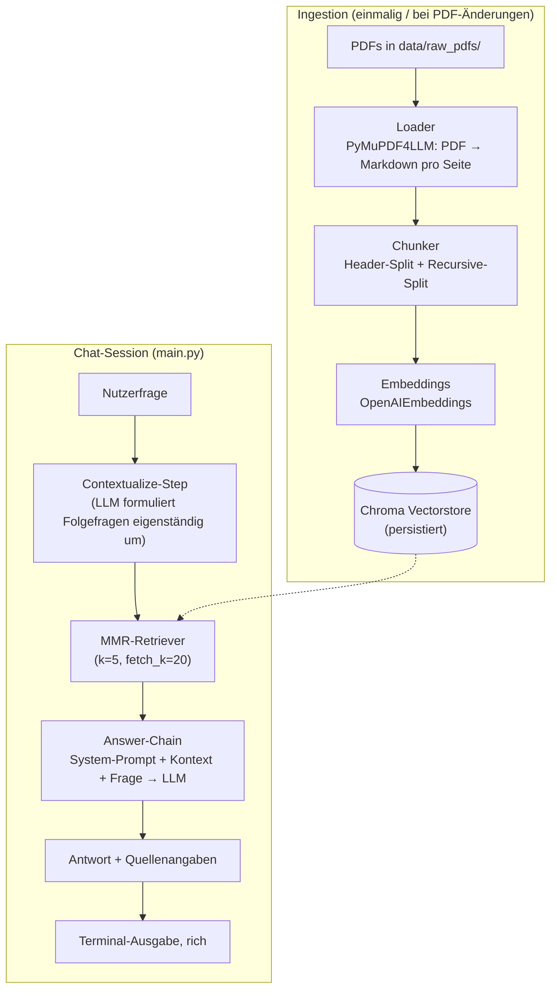

# Abaqus Handbuch-Chatbot — Technische Dokumentation

**Modul:** NLP-Studienmodul · **Typ:** Retrieval-Augmented-Generation-System (RAG)
**Domäne:** Bedienungsfragen zur FEA-Software Abaqus, beantwortet auf Basis der
offiziellen PDF-Handbücher

---

## Inhaltsverzeichnis

1. [Zielsetzung](#1-zielsetzung)
2. [Systemüberblick](#2-systemüberblick)
3. [Tech-Stack & Designentscheidungen](#3-tech-stack--designentscheidungen)
4. [Ingestion-Pipeline](#4-ingestion-pipeline)
5. [RAG-Engine](#5-rag-engine)
6. [Terminal-Chat-Interface](#6-terminal-chat-interface)
7. [Konfiguration](#7-konfiguration)
8. [Projektstruktur](#8-projektstruktur)
9. [Setup & Nutzung](#9-setup--nutzung)
10. [Tests](#10-tests)
11. [Verifikationsergebnisse](#11-verifikationsergebnisse)
12. [Frontend, LLM- und Parser-Vergleich](#12-frontend-llm--und-parser-vergleich)
13. [Bekannte Grenzen & mögliche Erweiterungen](#13-bekannte-grenzen--mögliche-erweiterungen)

---

## 1. Zielsetzung

Der Chatbot soll Nutzer:innen bei der Bedienung der FEA-Software **Abaqus**
unterstützen, indem er Fragen in natürlicher Sprache auf Basis der offiziellen
PDF-Handbücher beantwortet — mit **Seiten-genauer Quellenangabe**, damit die
Antwort im Original nachgeschlagen werden kann, und mit **Gesprächsgedächtnis**
für Folgefragen ("Und wie mache ich das für Modell X?").

Anders als ein generisches LLM darf der Bot **nur** auf Basis des tatsächlich
im Handbuch gefundenen Kontexts antworten — Halluzinationen werden durch einen
strikten System-Prompt und expliziten "Ich weiß es nicht"-Fallback minimiert.

## 2. Systemüberblick

Das System besteht aus zwei getrennten Phasen:



Beide Phasen sind vollständig entkoppelt: Die Ingestion läuft einmalig über
`scripts/ingest.py`, die Chat-Session lädt den fertigen Vectorstore lediglich
über `scripts`-unabhängiges `main.py`.

## 3. Tech-Stack & Designentscheidungen

Zwei Kategorien: fest verdrahtete Architekturentscheidungen ohne evaluierte
Alternative (3.1) und Pipeline-Komponenten, die austauschbar sind und einzeln
per RAGAS gegen Alternativen evaluiert wurden (3.2, Details in Abschnitt 12).

### 3.1 Feste Designentscheidungen

| Bereich | Wahl | Begründung |
|---|---|---|
| **Vektor-DB** | Chroma (lokal, persistent, SQLite-basiert) | Kein Serverbetrieb nötig, native LangChain-Integration, unterstützt Metadaten-Filter. FAISS bietet keine native Metadaten-Filterung; Qdrant/LanceDB wären für den Umfang dieses Projekts unnötiger Infra-Overhead. |
| **RAG-Orchestrierung** | Reine [LCEL](https://python.langchain.com/docs/concepts/lcel/)-Runnables (kein `langchain.chains`) | Die installierte LangChain-Version (≥1.0) hat das klassische `langchain.chains`-Modul — inkl. `create_retrieval_chain` / `create_history_aware_retriever` — vollständig entfernt und die Bibliothek auf einen Agent-zentrierten Ansatz (`langchain.agents.create_agent`) umgebaut. Statt eines veralteten Compat-Layers (`langchain-classic`) wird die Kette hier transparent aus einzelnen `Runnable`-Bausteinen zusammengesetzt — näher am eigentlichen LCEL-Paradigma und mit voller Kontrolle über das Source-Tracking. |
| **Conversation Memory** | Einfache Nachrichtenliste (`list[BaseMessage]`) innerhalb der CLI-Session | Für ein Single-User-Terminal-Tool ausreichend; der für Multi-User-/Webanwendungen gedachte `RunnableWithMessageHistory`-Session-Store wäre hier unnötige Komplexität. |
| **Config-Management** | `pydantic-settings` | Typsichere, validierte Konfiguration aus `.env`; verhindert stille Fehlkonfiguration (z. B. fehlender API-Key wird sofort beim Start als Validierungsfehler sichtbar, nicht erst beim ersten API-Call). |
| **Terminal-UI** | `rich` | Markdown-Rendering der Antworten, Spinner während des Retrievals, farbige/strukturierte Ausgabe ohne zusätzliches Web-Framework. |

### 3.2 Austauschbare Pipeline-Komponenten

| Komponente | Produktiv-Default | Vergleich |
|---|---|---|
| **PDF-Parser** | PyMuPDF4LLM | 4 Parser (inkl. Docling, pdfplumber, Unstructured) per RAGAS verglichen — [`docs/PARSER.md`](PARSER.md), Abschnitt 12.2–12.3 |
| **Chunking** | Header+Recursive 800 | 6 Strategien verglichen, u. a. Semantic Chunking — [`docs/CHUNKING.md`](CHUNKING.md), Abschnitt 12.4 |
| **Embeddings** | `text-embedding-3-small` | 7 Modelle verglichen (3 OpenAI + 4 lokal) — [`docs/EMBEDDING.md`](EMBEDDING.md), Abschnitt 12.5 |
| **Retrieval-Strategie** | MMR (`k=5`, `fetch_k=20`) | 4 Strategien verglichen (Similarity, Rerank, BM25-Hybrid) — [`docs/RETRIEVAL.md`](RETRIEVAL.md), Abschnitt 12.6 |
| **Antwort-LLM** | `gpt-4o-mini` | 3 Modelle verglichen (OpenAI-mini, GPT-4o, Mistral `mistral-small-latest`) — [`docs/LLM.md`](LLM.md), Abschnitt 12.8 |

Die Kombination der fünf Einzelsieger gegen die Produktiv-Baseline:
[`docs/BEST_OF_BREED.md`](BEST_OF_BREED.md), Abschnitt 12.7.

## 4. Ingestion-Pipeline

Pfad: `src/rag_manual_bot/ingestion/`

### 4.1 Loader (`loader.py`)

```python
def load_pdf(pdf_path: Path) -> list[PageDocument]:
    pages = pymupdf4llm.to_markdown(str(pdf_path), page_chunks=True, show_progress=False)
    doc = pymupdf.open(str(pdf_path))
    try:
        result = []
        for page in pages:
            if not page["text"].strip():
                continue
            pdf_index_1based = page["metadata"]["page_number"]
            printed_label = doc[pdf_index_1based - 1].get_label() or str(pdf_index_1based)
            result.append(
                PageDocument(
                    text=page["text"], source_file=pdf_path.name,
                    page_number=printed_label, pdf_page_index=pdf_index_1based,
                )
            )
        return result
    finally:
        doc.close()
```

- `page_chunks=True` liefert pro PDF-Seite ein Dict mit Markdown-Text **und**
  Metadaten (u. a. `page_number`) — allerdings ist dieser Wert nur die
  **sequenzielle Position** der Seite in der Datei (1-basiert), nicht die
  unten auf der Seite gedruckte Seitenzahl. Handbücher haben typischerweise
  ein Titelblatt und ein römisch nummeriertes Vorwort vor dem eigentlichen
  Inhalt, wodurch beide Zählungen um mehrere Seiten auseinanderlaufen (z. B.
  PDF-Position 1061 → gedrucktes Label "1059").
- Der Loader liest daher zusätzlich die im PDF eingebetteten **Page-Labels**
  (`/PageLabels` im PDF-Katalog, zugänglich über `page.get_label()`) aus und
  verwendet dieses gedruckte Label für `page_number` — genau die Zahl, die
  auch beim Nachschlagen im gedruckten/PDF-Dokument unten auf der Seite
  steht. Da Vorwort-Seiten römisch nummeriert sind (`"iv"`, `"ix"`, …), ist
  `page_number` als `str` statt `int` typisiert. Fehlen `/PageLabels` in
  einem PDF (nicht der Fall bei den getesteten Handbüchern), fällt der
  Loader auf die sequenzielle Position zurück.
- Zusätzlich zum gedruckten Label führt jedes `PageDocument` die
  **physische** PDF-Position (`pdf_page_index`, 1-basiert) parallel mit —
  nötig für die klickbaren Quellen-Links, die auf die tatsächliche
  Datei-Position statt das gedruckte Label zeigen müssen (siehe 5.4).
- Enthält eine Seite Scan-/Bildinhalt statt echten Text, greift PyMuPDF4LLM
  automatisch auf **Tesseract-OCR** zurück (in den Logs sichtbar als
  `OCR on page.number=...`). Das war bei der Ingestion der beiden Test-Handbücher
  bei einigen hundert Seiten (Diagramme, Screenshots) der Fall.
- Leere Seiten werden verworfen.

### 4.2 Chunker (`chunker.py`)

Zweistufiger Ablauf pro Seite:

1. **`MarkdownHeaderTextSplitter`** (`headers_to_split_on = [#, ##, ###]`,
   `strip_headers=False`) trennt den Seitentext entlang der
   Überschriften-Hierarchie. Jede resultierende Sektion trägt den
   Überschriftenpfad in ihren Metadaten (`h1`, `h2`, `h3`).
2. Ist eine Sektion länger als `CHUNK_SIZE` Zeichen (Default 800), wird sie
   zusätzlich mit `RecursiveCharacterTextSplitter`
   (`chunk_overlap=150`, Separator-Priorität `\n\n → \n → ". " → " "`)
   in kleinere, überlappende Teile zerlegt.

Jeder finale Chunk erhält vier Metadaten-Felder:

```python
{
    "source_file": "Abaqus2017_GETTINGSTARTED.pdf",
    "page_number": "1059",
    "pdf_page_index": 1061,
    "section": "Getting Started with Abaqus > Creating a Model > Boundary Conditions",
}
```

`section` wird aus den Header-Metadaten als lesbarer Pfad (`h1 > h2 > h3`)
gebaut (`_section_path()`). Diese Metadaten fließen direkt in die
Kontext-Formatierung der Answer-Chain (siehe 5.3) und in die
Quellenanzeige der CLI (siehe 6).

**Seitenübergreifende Abschnitte:** Der `MarkdownHeaderTextSplitter` läuft
zwar weiterhin pro Seite, aber ein Abschnitt, der ohne neue Überschrift auf
der Folgeseite fortgesetzt wird, wird vor dem eigentlichen Chunking mit dem
letzten Abschnitt der Vorseite zusammengeführt (`_merge_page_boundary_continuations()`).
Kriterium: der erste Header-Abschnitt der Folgeseite trägt keine
Header-Metadaten (= keine Überschrift vor diesem Inhalt) und die Seite
folgt physisch direkt auf die vorige, bereits erfasste Seite derselben
Quelldatei — eine zwischen Ingestion-Lauf und Loader bereits herausgefilterte
Leerseite (Sprung in `pdf_page_index`) verhindert die Zusammenführung
bewusst. `page_number` wird für solche Chunks zu einem Bereich (z. B.
"1059-1060"), der PDF-Deep-Link (`pdf_page_index`) zeigt auf die Startseite.
**Verbleibende Einschränkung:** Liegt die für eine Antwort relevante
Textstelle näher am Ende eines solchen Mehrseiten-Chunks, zeigt der Link
trotzdem nur auf die erste der beiden Seiten — die Seitenangabe ist damit
approximativ statt exakt, aber nie mehr grundsätzlich falsch wie bei einem
mitten im Satz zerschnittenen Chunk.

Diese Logik (`chunk_pages`) ist seit dem Chunking-Vergleich ein dünner
Wrapper um `ingestion/chunking_backends/header_recursive_backend.py` mit den
Produktiv-Settings (`CHUNK_SIZE`/`CHUNK_OVERLAP`) — dieselbe Funktion ist
dort zusätzlich unter zwei weiteren Größenvarianten sowie neben drei
strukturell anderen Chunking-Strategien registriert (siehe
[`docs/CHUNKING.md`](CHUNKING.md), Abschnitt 12.4).

### 4.3 Vectorstore (`rag/vectorstore.py`)

`build_vectorstore()` erzeugt (bzw. leert und befüllt neu) eine Chroma-Collection:

- Bestehende Einträge werden vor dem Neuaufbau vollständig gelöscht
  (`store.delete(ids=existing_ids)`) — für den vollständigen Neuaufbau
  (`scripts/ingest.py --force`, siehe unten).
- Dokumente werden in Batches von 200 eingefügt (`add_documents`), um sehr
  große Requests an die Embedding-API zu vermeiden.
- Für das inkrementelle Update (Standardfall) ergänzen
  `add_documents_to_vectorstore()` und `delete_source_files()` gezielt nur
  die betroffenen Dokumente, ohne die Collection zu leeren (siehe 4.4).
- Persistenzort: `vectorstore/` (git-ignored), Collection-Name
  `abaqus_manuals`.

### 4.4 Orchestrierung (`pipeline.py`, `scripts/ingest.py`)

`run_ingestion()` liest standardmäßig **inkrementell** ein: Ein
SHA-256-Fingerabdruck pro PDF wird in
`ingestion_manifest.json` neben der Collection gespeichert. Bei jedem Lauf
wird der aktuelle Fingerabdruck jeder Datei in `data/raw_pdfs/` mit dem
Manifest verglichen:

```python
def run_ingestion(force: bool = False, embeddings: Embeddings | None = None) -> int:
    current = {p.name: fingerprint(p) for p in raw_pdf_dir.glob("*.pdf")}
    if force or not persist_directory.exists():
        build_vectorstore(chunk_pages(load_pdf_directory(raw_pdf_dir)))
        save_manifest(current)
        return num_chunks
    previous = load_manifest()
    changed_or_new = {n for n, fp in current.items() if previous.get(n) != fp}
    removed = set(previous) - set(current)
    if not changed_or_new and not removed:
        return 0                                    # No-op: keine API-Calls
    delete_source_files(changed_or_new | removed)    # betroffene Chunks entfernen
    new_chunks = [chunk for n in changed_or_new for chunk in chunk_pages(load_pdf(raw_pdf_dir / n))]
    add_documents_to_vectorstore(new_chunks)         # neue Chunks ergänzen
    save_manifest(current)
    return len(new_chunks)
```

Unveränderte Dateien werden komplett übersprungen (kein Parsen, kein
Embedding-API-Call); neue/geänderte Dateien werden neu geparst, gechunkt und
eingebettet; Dateien, die aus `data/raw_pdfs/` entfernt wurden, werden über
`delete_source_files()` (Metadaten-Filter auf `source_file`) aus der
Collection gelöscht. Da `_merge_page_boundary_continuations()` (Abschnitt
4.2) Seitenübergänge nur innerhalb derselben Quelldatei zusammenführt, ist
das isolierte Chunken einer einzelnen Datei bit-identisch zum Chunken im
Kontext aller Dateien — das Delta-Update verändert also nicht das Ergebnis,
nur die Laufzeit. `force=True` (CLI: `--force`) erzwingt einen kompletten
Neuaufbau aller Dateien, z. B. nach einem Chunking- oder
Embedding-Modell-Wechsel, den der reine Dateiinhalts-Fingerabdruck nicht
erkennen kann.

`scripts/ingest.py` ist der CLI-Entry-Point (`python scripts/ingest.py` bzw.
`--force`), zeigt Fortschritt über einen `rich`-Spinner und die
Gesamtlaufzeit an. Getestet in `tests/test_pipeline.py` (offline, mit
Fake-Embeddings und on-the-fly erzeugten Mini-PDFs statt der echten
Handbücher).

## 5. RAG-Engine

Pfad: `src/rag_manual_bot/rag/`

### 5.1 Retriever (`retriever.py`, `retrieval_backends.py`)

```python
vectorstore.as_retriever(
    search_type="mmr",
    search_kwargs={"k": settings.retrieval_k, "fetch_k": settings.retrieval_fetch_k},
)
```

MMR holt zunächst `fetch_k=20` Kandidaten per Ähnlichkeitssuche und wählt
daraus `k=5` möglichst diverse Dokumente aus — vermeidet, dass mehrere
nahezu identische Chunks derselben Seite den gesamten Kontext belegen. Das
ist der Produktiv-Default, aber austauschbar:
`build_rag_chain(vectorstore, retrieval_strategy=...)` wählt über
`rag/retrieval_backends.py::RETRIEVAL_BACKENDS` zwischen MMR, reiner
Similarity-Suche, Cross-Encoder-Reranking und BM25-Hybrid-Retrieval.

### 5.2 Prompts (`prompts.py`)

Zwei getrennte Prompts für die zwei Aufgaben der Kette:

**Contextualize-Prompt** (Frage-Umformulierung bei Folgefragen):
> "Du bekommst einen Chatverlauf und die neueste Nutzerfrage, die sich
> eventuell auf den Chatverlauf bezieht. Formuliere die Frage bei Bedarf so
> um, dass sie ohne den Chatverlauf verständlich ist. Beantworte die Frage
> NICHT, gib sie unverändert zurück, falls sie bereits eigenständig
> verständlich ist."

**Answer-Prompt** (eigentliche Antwortgenerierung):
> "Du bist ein hilfreicher technischer Assistent für die
> Finite-Elemente-Software Abaqus. Beantworte Fragen zur Bedienung der
> Software ausschließlich auf Basis des folgenden Kontexts aus dem
> offiziellen Handbuch.
>
> Regeln:
> - Nutze NUR Informationen aus dem gegebenen Kontext. Erfinde nichts dazu.
> - Wenn der Kontext die Frage nicht beantwortet, sage das klar und rate NICHT.
> - Antworte präzise, in Schritten/Listen, wenn eine Bedienungsanleitung gefragt ist.
> - Antworte auf Deutsch, außer der Nutzer fragt explizit auf Englisch.
> - Referenziere relevante Menüpfade/Begriffe exakt wie im Handbuch angegeben."

Beide Prompts nutzen `MessagesPlaceholder("chat_history")`, um den bisherigen
Gesprächsverlauf als vollwertige Chat-Nachrichten (nicht als Textblock)
einzubetten.

### 5.3 LCEL-Kette (`chain.py`)

Die Kette wird schrittweise über verkettete `RunnablePassthrough.assign(...)`
aufgebaut — jeder Schritt reichert das durchlaufende Dict um ein weiteres
Feld an:

```python
contextualize_chain = RunnableBranch(
    (lambda x: len(x["chat_history"]) == 0, RunnableLambda(lambda x: x["question"])),
    contextualize_prompt | llm | StrOutputParser(),
)

answer_chain = (
    {
        "context": itemgetter("context"),
        "chat_history": itemgetter("chat_history"),
        "question": itemgetter("standalone_question"),
    }
    | answer_prompt | llm | StrOutputParser()
)

chain = (
    RunnablePassthrough.assign(standalone_question=contextualize_chain)
    .assign(source_documents=lambda x: retrieve(x["standalone_question"]))
    .assign(context=lambda x: format_docs(x["source_documents"]))
    .assign(answer=answer_chain)
)
```

Ablauf pro `chain.invoke({"question": ..., "chat_history": [...]})`:

1. **`standalone_question`** — Ist `chat_history` leer, wird die Frage
   unverändert übernommen (`RunnableBranch` spart in diesem Fall einen
   unnötigen LLM-Call). Andernfalls formuliert der Contextualize-Prompt die
   Frage anhand des Verlaufs eigenständig um (z. B. löst "*Und wie
   definiere ich danach die Randbedingungen dafür?*" zu "*Wie definiere ich
   die Randbedingungen für ein Modell in Abaqus/CAE?*" auf — siehe
   [Verifikationsergebnisse](#11-verifikationsergebnisse)).
2. **`source_documents`** — Der gewählte Retriever (Default MMR, seit 5.1
   austauschbar über `retrieval_strategy`) wird mit der eigenständigen Frage
   aufgerufen, liefert die Top-`k` Chunks samt Metadaten.
3. **`context`** — `format_docs()` baut daraus einen nummerierten,
   zitierfähigen Textblock:

   ```text
   [Quelle 1: Abaqus2017_GETTINGSTARTED.pdf, Seite 1059]
   (Abschnitt: Getting Started > Creating a Model)
   <Chunk-Text>

   ---

   [Quelle 2: Abaqus2017_ANALYSIS.pdf, Seite 1025]
   ...
   ```

4. **`answer`** — Answer-Prompt (System-Prompt + `context` + `chat_history` +
   `standalone_question`) geht ans LLM, die Antwort wird als reiner Text
   zurückgegeben.

Das Ergebnis-Dict enthält am Ende alle Zwischenwerte (`question`,
`chat_history`, `standalone_question`, `source_documents`, `context`,
`answer`) — die CLI nutzt daraus `answer` für die Ausgabe und
`source_documents` für die Quellenanzeige, ohne dass die Kette dafür
speziell angepasst werden muss.

### 5.4 Source-Tracking

Jeder Chunk trägt `source_file`, `page_number` (gedrucktes Label) und
`pdf_page_index` (physische Position in der PDF-Datei, siehe 4.1) als
Metadaten seit der Ingestion. `format_docs()` reicht `source_file` und
`page_number` als Zitat in den LLM-Kontext, `_format_sources()` (in
`cli/chat.py` bzw. `app.py`) dedupliziert die Quellen (nach Datei+Seite,
Reihenfolge der ersten Nennung bleibt erhalten) und zeigt sie unter der
Antwort an.

**Klickbare Quellen-Links:** `citations.py` (liegt bei `src/rag_manual_bot/citations.py`,
nicht unter `rag/`) baut über `source_pdf_link()` aus `source_file` und
`pdf_page_index` eine `file://`-URL mit PDF-Seitenanker (`...#page=N`), z. B.:

```
file:///.../data/raw_pdfs/Abaqus2017_GETTINGSTARTED.pdf#page=1061
```

Der Anker muss sich auf die **physische** Seitenposition beziehen (nicht
das gedruckte Label), da PDF-Viewer `#page=N` als reinen Index in die Datei
interpretieren — deshalb führt die Pipeline seit dieser Erweiterung beide
Werte parallel mit. Im Terminal-Chat werden die Links über `rich`s
`[link=URL]...[/link]`-Markup als klickbare OSC-8-Hyperlinks ausgegeben
(funktioniert in Terminals mit OSC-8-Unterstützung, z. B. iTerm2, moderne
Terminal.app-Versionen; bei Pipe-Ausgabe oder nicht unterstützten Terminals
wird nur der Klartext angezeigt).

**Streamlit-Frontend nutzt bewusst *keine* `file://`-Links:** Moderne
Browser blockieren `file://`-Navigation, die von einer `http(s)://`-Seite
ausgelöst wird, zuverlässig — ein reiner Markdown-Link auf `citations.py`s
`file://`-URL wäre dort also im Zweifel tot. `app.py::_static_pdf_link()`
baut stattdessen einen `http(s)://`-relativen Link über Streamlits
eingebautes Static-File-Serving (`app/static/<Datei>#page=N`, aktiviert via
`enableStaticServing = true` in `.streamlit/config.toml`; `static/` ist ein
Symlink auf `data/raw_pdfs/`) — funktioniert zuverlässig, weil der Link vom
selben Origin wie die Streamlit-Seite kommt.

## 6. Terminal-Chat-Interface

Pfad: `src/rag_manual_bot/cli/chat.py`, Entry-Point `main.py`

- Lädt den bestehenden Vectorstore (`load_vectorstore()`); existiert er
  nicht, bricht die CLI mit einem Hinweis auf `scripts/ingest.py` ab, statt
  mit einer leeren Wissensbasis zu starten. Zu Beginn zeigt ein `rich.Panel`
  das aktive Modell (`settings.llm_model`) und die geladene Wissensbasis.
- Chat-Loop mit `rich.console.Console.input`; Nachrichtenverlauf wird als
  `list[BaseMessage]` (`HumanMessage`/`AIMessage`) über die gesamte Session
  gehalten und bei jeder Anfrage in `chain.stream()` mitgegeben.
- **Befehle:** `/help`, `/reset` (Verlauf leeren), `/exit` / `/quit` (auch
  `Strg+D`/`Strg+C`).
- **Streaming:** Tokens aus `chain.stream(...)` werden als Rohtext
  token-für-token ausgegeben, sobald sie eintreffen (`print(token, end="",
  flush=True)`), damit die Antwort ohne Wartezeit sichtbar wird — ein
  `rich.status`-Spinner überbrückt nur die Zeit bis zum ersten Chunk. Sobald
  der Stream vollständig ist, löscht `_visual_line_count()` + ANSI-Escapes
  (`\033[{n}A\033[J`) den bereits gedruckten Rohtext wieder und ersetzt ihn
  einmalig durch die gerenderte `rich.markdown.Markdown`-Fassung (Listen,
  Nummerierungen etc. bleiben lesbar) — der Trade-off aus Abschnitt 13:
  während des Streamens Rohtext, da Markdown-Rendering den vollständigen
  Text voraussetzt. Quellen erscheinen darunter gedimmt.
- API-/Netzwerkfehler werden sowohl vor Beginn des Streams (Anfrage bricht
  ab, Chat läuft weiter) als auch währenddessen abgefangen — im zweiten Fall
  bleiben bereits gestreamte Tokens als Antwort erhalten, damit sichtbarer
  Chatverlauf und `chat_history` nicht auseinanderlaufen.

## 7. Konfiguration

Alle Einstellungen liegen typsicher in `src/rag_manual_bot/config.py`
(`pydantic_settings.BaseSettings`), geladen aus `.env` im Projektroot.

| Variable | Default | Beschreibung |
|---|---|---|
| `OPENAI_API_KEY` | *(erforderlich)* | API-Key für Chat- und Embedding-Modell. |
| `OPENAI_BASE_URL` | `None` (→ `api.openai.com`) | Für OpenAI-kompatible Gateways, z. B. das FH-SWF-Hochschul-Hub (`https://hub.ki.fh-swf.de/v1`). |
| `LLM_MODEL` | `gpt-4o-mini` | Chat-Modell. Bei manchen Gateways (LiteLLM-Proxys) mit Provider-Prefix nötig, z. B. `openai/gpt-4o-mini`. |
| `EMBEDDING_MODEL` | `text-embedding-3-small` | Embedding-Modell, gleiche Prefix-Regel. |
| `LLM_TEMPERATURE` | `0.0` | Deterministische Antworten bevorzugt für Bedienungsanleitungen. |
| `CHUNK_SIZE` | `800` | Ziel-Chunkgröße (Zeichen) für den Recursive-Fallback-Split. |
| `CHUNK_OVERLAP` | `150` | Überlappung zwischen benachbarten Fallback-Chunks. |
| `RETRIEVAL_K` | `5` | Anzahl finaler Chunks pro Anfrage. |
| `RETRIEVAL_FETCH_K` | `20` | Kandidatenpool für MMR, aus dem `k` ausgewählt wird. |
| `API_REQUEST_TIMEOUT` | `60` | Timeout (Sekunden) für alle OpenAI-/Mistral-API-Clients (LLMs, Embeddings). |
| `API_MAX_RETRIES` | `2` | Retry-Anzahl für dieselben API-Clients. |

Zusätzlich fest im Code (nicht über `.env` gesteuert, da projektspezifisch):
`raw_pdf_dir` (`data/raw_pdfs/`), `vectorstore_dir` (`vectorstore/`),
`collection_name` (`abaqus_manuals`).

**Nur für Vergleichsstudien & RAGAS-Richter** (weder für `main.py` noch für
`app.py` erforderlich, siehe Abschnitt 12):

| Variable | Default | Beschreibung |
|---|---|---|
| `MISTRAL_API_KEY` | *(optional)* | Für Mistral als Antwort-LLM im LLM-/Best-of-Breed-Vergleich (`docs/LLM.md`, `docs/BEST_OF_BREED.md`); ohne Key laufen die betroffenen `evaluate_*`-Skripte mit Mistral nicht. |
| `MISTRAL_MODEL` | `mistral-small-latest` | Mistral-Antwort-LLM-Variante. |
| `GPT4O_MODEL` | `gpt-4o` | Antwort-LLM-Variante im LLM-/Best-of-Breed-RAGAS-Vergleich (`docs/LLM.md`, `docs/BEST_OF_BREED.md`), läuft über denselben Key/Hub wie `LLM_MODEL`; seit Entfernen der Pipeline-Auswahl in `app.py` (siehe Abschnitt 12) nicht mehr produktiv genutzt. |
| `ANTHROPIC_API_KEY` | *(optional)* | Für den unabhängigen Claude-Richter (`eval/metrics.py::build_judge_metrics(provider="anthropic")`, siehe 12.7/12.8); erforderlich für `scripts/evaluate_*_ragas.py`. |
| `JUDGE_MODEL` | `claude-sonnet-5` | Claude-Richter-Modell. |

### Besonderheit: Hochschul-Gateway

Der Chatbot wurde erfolgreich gegen das FH-SWF-KI-Hub
(`https://hub.ki.fh-swf.de/v1`, ein OpenAI-kompatibler LiteLLM-Proxy)
getestet. Zwei Punkte waren dabei zu beachten:

1. `base_url` muss sowohl an `ChatOpenAI` als auch an `OpenAIEmbeddings`
   durchgereicht werden (`langchain_openai`-Konstruktor-Parameter
   `base_url`).
2. Modell-IDs benötigen auf diesem Gateway ein Provider-Prefix
   (`openai/gpt-4o-mini`, `openai/text-embedding-3-small`) — ohne Prefix
   antwortet die API mit `401`/`404`. Verfügbare Modelle lassen sich über
   `GET /v1/models` auflisten.

## 8. Projektstruktur

```
Abaqus_chatbot/
├── data/
│   ├── raw_pdfs/                 # Produktiv-Quell-PDFs (git-ignored)
│   └── parser_demo_pdfs/         # Deterministischer Parser-Vergleichs-Demo-Korpus (12.2)
├── vectorstore/                  # Produktiv-Chroma-DB (git-ignored)
├── vectorstore_parser_demo/       # Demo-Collections je Vergleichsstudie (12.2–12.7,
├── vectorstore_chunking_demo/     # git-ignored) — jeweils eine Collection pro
├── vectorstore_embedding_demo/    # verglichenem Parser/Chunking/Embedding
├── vectorstore_full_custom/       # + on-demand gebaute Kombinationen (app.py-Sidebar)
├── docs/
│   ├── DOKUMENTATION.md          # dieses Dokument
│   └── PARSER.md / CHUNKING.md / EMBEDDING.md / RETRIEVAL.md / LLM.md /
│       BEST_OF_BREED.md / RAGAS.md / …  # Vergleichsstudien (12)
├── src/rag_manual_bot/
│   ├── config.py                 # pydantic-settings (.env)
│   ├── citations.py              # Klickbare PDF-Deep-Links für den Terminal-Chat (5.4)
│   ├── ingestion/
│   │   ├── loader.py             # PDF -> Markdown pro Seite (PyMuPDF4LLM)
│   │   ├── chunker.py            # Produktiv-Chunking (Wrapper um header_recursive_backend)
│   │   ├── chunking_backends/    # 6 austauschbare Chunking-Strategien (docs/CHUNKING.md)
│   │   ├── parser_backends/      # 4 austauschbare PDF-Parser (Abschnitt 12.2)
│   │   ├── parser_demo.py        # Demo-Korpus-Aufbau für Parser-Vergleich
│   │   ├── chunking_demo.py      # Demo-Korpus-Aufbau für Chunking-Vergleich
│   │   ├── embedding_models.py   # 7 Embedding-Modelle: 3 OpenAI + 4 HF lokal (docs/EMBEDDING.md)
│   │   ├── embedding_demo.py     # Demo-Korpus-Aufbau für Embedding-Modell-Vergleich
│   │   ├── custom_demo.py        # app.py-Sidebar: beliebige Kombination auflösen/on-demand bauen
│   │   └── pipeline.py           # Orchestrierung
│   ├── rag/
│   │   ├── vectorstore.py        # Chroma-Aufbau/-Ladefunktionen
│   │   ├── retriever.py          # MMR-Retriever (Produktiv-Default)
│   │   ├── retrieval_backends.py # 4 Retrieval-Strategien (docs/RETRIEVAL.md)
│   │   ├── llms.py               # LLM-Provider-Auswahl, `get_llm()` (Abschnitt 12.1)
│   │   ├── prompts.py            # System-Prompts
│   │   └── chain.py              # LCEL-Kette
│   ├── cli/
│   │   └── chat.py               # Terminal-Chat (rich, Streaming, siehe 6)
│   └── eval/                     # RAGAS-Evaluation aller Vergleichsstudien (12.3–12.8)
│       ├── dataset.py            # 12-Fragen-Set (docs/EVAL_FRAGEN.md)
│       ├── metrics.py            # RAGAS-Metriken + Richter-Aufbau (build_judge_metrics)
│       └── run.py                # Evaluierungs-Läufe je Vergleichsstudie
├── scripts/                       # CLI-Entry-Points: ingest.py + build_*_demo_corpus.py /
│                                  # evaluate_*_ragas.py je Vergleichsstudie
├── main.py                       # Terminal-Chat-Entry-Point
├── app.py                        # Streamlit-Frontend (Abschnitt 12)
├── tests/                        # 7 Testmodule + conftest.py (Details siehe Abschnitt 10)
├── requirements.txt              # Basis-Requirements
├── requirements-*.txt            # Optionale Extras je Vergleichsstudie (Parser/Chunking/
│                                  # Embedding-Vergleich, RAGAS-Eval)
├── .env / .env.example
└── README.md
```

## 9. Setup & Nutzung

```bash
python3.13 -m venv .venv
source .venv/bin/activate
pip install -r requirements.txt

cp .env.example .env
# OPENAI_API_KEY (und ggf. OPENAI_BASE_URL / *_MODEL) eintragen

python scripts/ingest.py   # einmalig: Wissensbasis aufbauen
python main.py              # Chat starten
```

## 10. Tests

```bash
python -m pytest tests/ -v
```

Alle Tests laufen **vollständig offline** — es wird keine echte OpenAI-Verbindung
benötigt:

- `tests/conftest.py` setzt einen Dummy-`OPENAI_API_KEY`, damit das
  `Settings()`-Modul (das beim Import validiert) auch ohne echten Key
  importierbar ist.
- `tests/test_chunker.py` (3) prüft, dass Überschriften-Metadaten korrekt
  übernommen werden, überlange Abschnitte gesplittet werden und leere
  Seiten keine Chunks erzeugen.
- `tests/test_retriever.py` (2) nutzt eine selbstgeschriebene
  `FakeEmbeddings`-Klasse (deterministischer SHA256-basierter Pseudo-Vektor
  statt echtem API-Call), um den MMR-Retriever und `format_docs()` gegen
  einen In-Memory-Chroma-Store zu testen.
- `tests/test_chunking_backends.py` (10) deckt alle sechs Chunking-Backends
  aus dem Chunking-Vergleich (Abschnitt 12.4) ab, inkl. der drei Fälle rund
  um `_merge_page_boundary_continuations()` (Merge, Nicht-Merge bei neuer
  Überschrift, Nicht-Merge bei Seitensprung, siehe Abschnitt 4.2).
- `tests/test_pipeline.py` (5) prüft die inkrementelle Ingestion
  (Abschnitt 4.4): Erstlauf baut alles, No-op bei unveränderten Dateien,
  gezieltes Neu-Verarbeiten nur der geänderten Datei, Löschen entfernter
  Dateien, `--force` erzwingt Vollaufbau.
- `tests/test_embedding_models.py` (5) prüft die Embedding-Registry
  (drei OpenAI- plus vier HuggingFace-Modelle, Abschnitt 12.5), den
  Prefix-Wrapper für `multilingual-e5-large` sowie die Modell-Prefix-Auflösung.
- `tests/test_retrieval_backends.py` (7) prüft die vier Retrieval-Strategien
  (Abschnitt 12.6), insbesondere die selbst implementierte BM25-Indizierung
  und Reciprocal-Rank-Fusion (Ranking, Deduplizierung, `k`-Grenze).
- `tests/test_llms.py` (4) prüft die LLM-Provider-Auswahl (`get_llm()`),
  inkl. der `gpt4o`-Variante aus Abschnitt 12.8.
- `tests/test_custom_demo.py` (13) prüft `resolve_collection()`
  (Abschnitt 12) — bekannte Parser-/Chunking-/Embedding-Kombinationen aus
  den Demo-Korpora werden korrekt aufgelöst, unbekannte Kombinationen als
  solche erkannt, Default-Werte stimmen mit den Produktiv-Settings überein.
- `tests/test_eval_dataset.py` (2) prüft, dass der 12-Fragen-Datensatz
  (`eval/dataset.py`, siehe `docs/EVAL_FRAGEN.md`) wohlgeformt und
  duplikatfrei ist.

Aktueller Stand: **51/51 Tests grün.**

## 11. Verifikationsergebnisse

End-to-End-Lauf mit den Handbüchern `Abaqus2017_GETTINGSTARTED.pdf`,
`Abaqus2017_ANALYSIS.pdf`, `Abaqus2017_THEORY.pdf` und
`Abaqus2017_KEYWORDS.pdf` (zusammen ca. 5.100 Seiten):

- **Ingestion:** 15.408 Chunks in ca. 755 s (~12,6 Min.), inkl. automatischem
  OCR-Fallback für Bild-/Diagrammseiten.
- **Beispiel-Query (Keyword-Referenz)** — *"Was ist das \*STEP-Keyword und
  welche Parameter unterstützt es?"* → korrekte Antwort mit Parameterliste
  (u. a. `AMPLITUDE`), Quellen ausschließlich aus
  `Abaqus2017_KEYWORDS.pdf` (Seiten 1279, 814, 1282, 628, 1422) — bestätigt,
  dass THEORY/KEYWORDS gezielt abgerufen werden.
- **Beispiel-Query 1** — *"Wie erstelle ich ein neues Modell in
  Abaqus/CAE?"* → Schritt-für-Schritt-Antwort (Model-Datenbank anlegen,
  Part-Modul, Model Tree, Create-Part-Dialog …), Quellen u. a.
  `Abaqus2017_GETTINGSTARTED.pdf, Seite 1059`.
- **Beispiel-Query 2 (Folgefrage)** — *"Und wie definiere ich danach die
  Randbedingungen dafür?"* wurde vom Contextualize-Step korrekt zu *"Wie
  definiere ich die Randbedingungen für ein Modell in Abaqus/CAE?"*
  aufgelöst; Antwort verweist korrekt auf das Load-Modul und den
  "Create Boundary Condition"-Dialog.
- **CLI-Test** (`main.py` mit simuliertem Input): Formatierte
  Markdown-Ausgabe, korrekte Quellenliste, sauberer `/exit`.
- **Page-Label-Korrektur verifiziert:** Ein manueller Test zeigte, dass die
  ursprünglich verwendete Seitenzahl der sequenziellen PDF-Position statt
  der gedruckten Seitenzahl entsprach (z. B. `Seite 1061` statt korrekt
  `1059`, durch Titelblatt + römisch nummeriertes Vorwort verursacht). Nach
  Umstellung des Loaders auf PyMuPDFs Page-Labels (Abschnitt 4.1) wurde
  gegengeprüft, dass `doc[1060].get_text()` auf der als `"1059"` gelabelten
  Seite tatsächlich `"1059"` als Fußzeilentext enthält — Quellenangaben
  stimmen jetzt mit der im PDF unten gedruckten Seitenzahl überein.

## 12. Frontend, LLM- und Parser-Vergleich

Ergänzend zum Terminal-Chat (Abschnitt 6) gibt es ein Streamlit-Frontend
(`app.py`, `streamlit run app.py`) mit klassischer Chat-Optik
(`st.chat_message`/`st.chat_input`). Es bietet bewusst **nur die
Produktiv-Pipeline** an (`app.py::PIPELINES`, ein einziger Eintrag) — kein
Pipeline-Auswahlfeld/Radio-Button mehr in der Sidebar:

- **Produktiv** — PyMuPDF4LLM + Header+Recursive 800 +
  `text-embedding-3-small` + MMR + `gpt-4o-mini` (der in Abschnitt 12.2–12.6
  als Produktiv-Default verwendete Aufbau), voller ~5.100-Seiten-Korpus.

**Best-of-Breed steht im Frontend bewusst nicht mehr zur Wahl:** Die
Pipeline (Unstructured + Semantic Chunking + `text-embedding-3-large` +
Rerank + GPT-4o, siehe 12.7) bräuchte `vectorstore_full_custom/` — das ist
zu groß für GitHub (siehe `README.md`, "Setup") und daher nicht Teil des
Repos, und anders als bei der Produktiv-Collection (`python
scripts/ingest.py`, ~13 Min.) gibt es dafür kein schnelles Setup-Skript.
`ingestion/custom_demo.py::resolve_collection()` würde eine fehlende
Best-of-Breed-Collection zwar automatisch beim ersten Aufruf bauen, das
dauert wegen Unstructured `hi_res` auf ~5.100 Seiten aber ca. 5 Std. (siehe
`docs/PARSER.md`) — mitten im Streamlit-Request, ohne dass das wie ein
gewollter Vorgang statt einem Hänger aussähe. Um das zu vermeiden, wurde
die Pipeline-Auswahl komplett entfernt; die Best-of-Breed-Ergebnisse aus
12.7/`docs/BEST_OF_BREED.md` bleiben davon unberührt gültig, sind über die
App aber nicht mehr erreichbar. Der freie Wechsel zwischen den drei
Antwort-LLMs (OpenAI-mini, GPT-4o, Mistral `mistral-small-latest`) bleibt ausschließlich der
RAGAS-Studie (Abschnitt 12.8, `docs/LLM.md`) vorbehalten. Die einzelnen
Demo-Korpus-Vergleichsstudien (Parser 12.2–12.3, Chunking 12.4, Embedding
12.5, Retrieval 12.6) sind über die App ebenfalls nicht live auswählbar —
sie laufen ausschließlich über die jeweiligen
`scripts/evaluate_*_ragas.py`-Skripte.

### 12.1 LLM-Provider-Auswahl (`get_llm()`)

`rag/llms.py` kapselt die Provider-Auswahl hinter `get_llm(provider)` -
drei Provider (`openai`, `mistral`, `gpt4o`), siehe 12.8 für den
vollständigen RAGAS-Vergleich aller drei:

```python
def get_llm(provider: str = "openai") -> BaseChatModel:
    if provider == "openai":
        return ChatOpenAI(model=settings.llm_model, api_key=settings.openai_api_key,
                           base_url=settings.openai_base_url, temperature=settings.llm_temperature)
    if provider == "mistral":
        if not settings.mistral_api_key:
            raise ValueError("MISTRAL_API_KEY ist nicht gesetzt. ...")
        return ChatMistralAI(model=settings.mistral_model, api_key=settings.mistral_api_key,
                              temperature=settings.llm_temperature)
    if provider == "gpt4o":
        # Läuft über denselben Hub/Key wie "openai" - volles gpt-4o statt gpt-4o-mini.
        return ChatOpenAI(model=settings.gpt4o_model, api_key=settings.openai_api_key,
                           base_url=settings.openai_base_url, temperature=settings.llm_temperature)
```

`build_rag_chain(vectorstore, llm_provider=...)` reicht die Wahl an den
Contextualize- und Answer-Schritt der LCEL-Kette durch (Abschnitt 5.3) —
Retrieval, Prompts und Wissensbasis bleiben unverändert, sodass sich
Antwortqualität und -stil zwischen den Modellen sauber vergleichen lassen.
Mistral (`mistral-small-latest`) läuft über einen separaten API-Key (`MISTRAL_API_KEY`), da das
Hochschul-Gateway kein Mistral-Modell proxied (geprüft über `GET
/v1/models`). Im aktuellen `app.py` ist Mistral gar nicht mehr wählbar (siehe
oben, `PIPELINES` bietet nur `openai`/`gpt4o` an) — erreichbar ist der
Provider nur noch über die Eval-Skripte (`eval/run.py`). Dort wirft
`get_llm("mistral")` bei fehlendem Key einen klaren `ValueError` statt eines
unklaren API-Fehlers.

**Live verifiziert** (`mistral-small-latest` gegen den vollen
Produktiv-Korpus): Bei identischer Frage ("Was ist der Unterschied zwischen
Abaqus/Standard und Abaqus/Explicit?") lieferten beide Modelle inhaltlich
sehr ähnliche, korrekte Antworten mit denselben Quellenangaben — Mistral
formatiert tendenziell etwas ausführlicher mit tieferer
Markdown-Verschachtelung (mehr `###`-Zwischenüberschriften) als GPT-4o-mini.

### 12.2 Parser-Vergleich (4 Parser, ~50-Seiten-Demo-Korpus)

Die vier in `docs/PARSER.md` evaluierten Parser (PyMuPDF4LLM, pdfplumber,
Docling, Unstructured) sind über `ingestion/parser_backends/` als
austauschbare Module mit identischer Schnittstelle gekapselt:

```python
def parse(pdf_path: Path) -> dict[int, str]:
    """Seiten-Index (1-basiert, Position in der PDF-Datei) -> extrahierter Text."""
```

Unstructured `hi_res` ist bei ~5.100 Seiten mit geschätzt mehreren Stunden
Laufzeit nicht praktikabel; Docling ist zwar ebenfalls deutlich langsamer
als PyMuPDF4LLM, mit geschätzt ~50 Min. für den vollen Korpus aber
grundsätzlich machbar (Hochrechnung aus zwei warmen Läufen, siehe
`ingestion/custom_demo.py::_PARSER_SECONDS_PER_PAGE`). Eine Ingestion
des vollen Korpus mit allen vier Parsern bliebe dennoch durch Unstructured
dominiert und unverhältnismäßig aufwändig. Für den Frontend-Vergleich wird
daher ein fester, deterministischer **53-Seiten-Demo-Korpus** verwendet (`ingestion/parser_demo.py`,
`DEMO_PAGE_SPECS`), zusammengestellt aus genau den Inhaltstypen, die sich
im Parser-Vergleich als unterschiedlich schwierig erwiesen haben (TOC-Tabellen,
linienlose Mini-Tabelle, vollständiges Tutorial-Kapitel, Analyse-Kapitel).

Damit alle vier Parser trotz unterschiedlicher interner Seitenzählung exakt
dieselben, korrekten Zitate liefern, wird die Zuordnung von
Demo-PDF-Position zu Quelldatei + gedrucktem Seiten-Label **einmal zentral**
beim Aufbau der Demo-PDF berechnet (`build_demo_pdf()`, nutzt dieselbe
Page-Label-Logik wie der Produktiv-Loader, Abschnitt 4.1) und danach jedem
Parser-Ergebnis unabhängig von dessen eigener Seitenzählung übergestülpt.
Jeder Parser bekommt so eine eigene Chroma-Collection
(`parser_demo_<name>` unter `vectorstore_parser_demo/`):

```bash
pip install -r requirements-parser-comparison.txt
python scripts/build_parser_demo_corpus.py
```

**Ergebnis eines Live-Vergleichs** (identische Frage, vier Collections,
gleiches LLM): Bei der Frage *"Welcher DOF-Wert steht für Rotation um die
2-Achse?"* lieferten alle vier Parser-Varianten dieselbe korrekte Antwort
("6") — obwohl Doclings Rohtext die zugrunde liegende Tabellenstruktur
komplett verliert. Das LLM konnte den Strukturverlust im vorliegenden Fall
aus dem umgebenden Fließtext kompensieren.

### 12.3 Quantitative Evaluation (RAGAS)

Der anekdotische Live-Vergleich aus 12.2 wurde um eine systematische,
metrikbasierte Auswertung mit dem [RAGAS](https://docs.ragas.io/)-Framework
ergänzt: alle 4 Parser (Antwort-LLM fest `gpt-4o-mini`) auf demselben
Demo-Korpus, demselben 12-Fragen-Set
und fünf Metriken (Faithfulness, AnswerRelevancy, ContextPrecision,
ContextRecall, FactualCorrectness) — 240 Einzel-Scores, ausgewertet mit
einem fest gehaltenen Richter-LLM. Ergebnis in Kurzform (nach dem
Chunking-Seitengrenzen-Fix):
Unstructured und PyMuPDF4LLM liegen mit 0,801 bzw. 0,796 Gesamtmittelwert
praktisch gleichauf vorn, Docling und pdfplumber bleiben deutlich zurück
(⌀ 0,699 bzw. 0,644). Vollständige Methodik, Ergebnistabellen und
Einordnung: [`docs/PARSER.md`](PARSER.md).

### 12.4 Chunking-Vergleich (6 Strategien, RAGAS)

Analog zum Parser-Vergleich (12.2/12.3) wurde die Chunking-Strategie als
eigene, unabhängig variierbare Dimension isoliert: Parser fix
(PyMuPDF4LLM), sechs austauschbare Chunking-Backends unter
`ingestion/chunking_backends/` — der Produktiv-Hybrid-Chunker
(`header_recursive_800`, siehe 4.2) in drei Größenvarianten, eine naive
`recursive_only`-Baseline ohne Header-Awareness, eine token- statt
zeichenbasierte Variante (`token_based`) sowie embedding-basiertes
`semantic`-Chunking (`langchain_experimental.SemanticChunker`) — letzteres
die in Abschnitt 3 ursprünglich als unnötig teuer verworfene Alternative,
jetzt empirisch geprüft.

Aufbau (`ingestion/chunking_demo.py`, `scripts/build_chunking_demo_corpus.py`)
und Evaluation (`eval/run.py::run_chunking_evaluation`,
`scripts/evaluate_chunking_ragas.py`) folgen exakt demselben Muster wie beim
Parser-Vergleich — gleicher Demo-Korpus, gleiches 12-Fragen-Set, gleicher
fester `gpt-4o-mini`-Richter.

Vollständige Methodik, Vergleichspaare (welche Variable jeweils isoliert
wird) und Ergebnistabellen: [`docs/CHUNKING.md`](CHUNKING.md).

### 12.5 Embedding-Modell-Vergleich (7 Modelle, RAGAS)

Dritte isolierte Dimension neben Parser (12.2/12.3) und Chunking (12.4):
Parser und Chunking bleiben fix (PyMuPDF4LLM, Header+Recursive 800), nur das
Embedding-Modell variiert — drei OpenAI-Modelle (`text-embedding-3-small`,
Produktiv-Default, `-3-large`, `ada-002`) sowie vier lokale
HuggingFace/`sentence-transformers`-Modelle (`multilingual-e5-large`,
`bge-m3`, `paraphrase-multilingual-mpnet`, `minilm-l6-en`;
`ingestion/embedding_models.py::EMBEDDING_BACKENDS`).

Anders als bei Parser/Chunking-Backends (aber ähnlich im Prinzip) ist
`EMBEDDING_BACKENDS` eine Registry von Factories (`() -> Embeddings`), nicht
von Modellnamen — HuggingFace-Modelle sind keine `OpenAIEmbeddings`-Instanz.
Der HF-Import passiert lazy innerhalb der Factory (gleiches Prinzip wie beim
`semantic`-Chunking-Backend). Ein E5-spezifischer Prefix-Wrapper
(`_PrefixedHuggingFaceEmbeddings`) stellt sicher, dass
`multilingual-e5-large` mit den `"query: "`/`"passage: "`-Prefixen läuft, mit
denen es trainiert wurde — ohne die fällt seine Retrieval-Qualität spürbar
ab. Technisch relevant, unabhängig vom Provider: Ein Vectorstore muss mit
demselben Embeddings-**Objekt** geladen werden, mit dem er aufgebaut wurde
(Dimensionalität reicht von 384 bis 3072) — deshalb tragen
`rag/vectorstore.py::build_vectorstore()` und `load_vectorstore()` seit
diesem Vergleich einen optionalen `embeddings`-Parameter (eine fertige
`Embeddings`-Instanz, kein Modellname).

Aufbau (`ingestion/embedding_demo.py`, `scripts/build_embedding_demo_corpus.py`)
und Evaluation (`eval/run.py::run_embedding_evaluation`,
`scripts/evaluate_embedding_ragas.py`) folgen demselben Muster wie Parser-
und Chunking-Vergleich — gleicher Demo-Korpus, gleiches 12-Fragen-Set,
gleicher fester `gpt-4o-mini`-Richter.

Vollständige Methodik und Ergebnistabellen: [`docs/EMBEDDING.md`](EMBEDDING.md).

### 12.6 Retrieval-Strategie-Vergleich (4 Strategien, RAGAS)

Vierte isolierte Dimension neben Parser (12.2/12.3), Chunking (12.4) und
Embedding-Modell (12.5): Parser, Chunking und Embedding bleiben fix
(PyMuPDF4LLM, Header+Recursive 800, `text-embedding-3-small`), nur die
Retrieval-Strategie variiert — `mmr` (Produktiv-Default), `similarity`
(naive Baseline ohne MMR-Diversität), `rerank` (Cross-Encoder über
MMR-Kandidaten) und `hybrid` (BM25 + Dense, per Reciprocal Rank Fusion
kombiniert; `rag/retrieval_backends.py::RETRIEVAL_BACKENDS`).

Architektonisch der einfachste der vier Vergleiche: Retrieval ist eine reine
Query-Zeit-Entscheidung, es gibt **keinen eigenen Demo-Korpus-Build** — alle
vier Strategien laufen auf der bereits vorhandenen
`chunking_demo_header_recursive_800`-Collection. `build_rag_chain()` bekam
dafür einen `retrieval_strategy`-Parameter (Default `"mmr"`, unverändertes
Produktiv-Verhalten). BM25 (`hybrid`) ist über `rank_bm25` direkt
implementiert statt über das laut Upstream im Sunsetting-Modus befindliche
`langchain_community.retrievers.BM25Retriever` (gleiche Begründung wie beim
`_ragas_compat`-Stub, siehe `docs/RAGAS.md`); die Fusion läuft über eine selbst
implementierte Reciprocal Rank Fusion statt einer
`langchain.retrievers.EnsembleRetriever`-Abhängigkeit. Schließt den in
Abschnitt 13 zuvor offenen Punkt "Kein Re-Ranking / keine Contextual
Compression".

Vollständige Methodik und Ergebnistabellen: [`docs/RETRIEVAL.md`](RETRIEVAL.md).

### 12.7 Best-of-Breed: Kombination der vier Einzelsieger

Die vier Vergleiche (12.2–12.6) variieren jeweils isoliert genau eine
Dimension — kombiniert getestet wurden die vier Einzelsieger (Unstructured,
Semantic Chunking, `text-embedding-3-large`, Rerank) bisher nicht. Dieses
abschließende Experiment (`scripts/build_best_of_breed_demo.py`,
`eval/run.py::run_best_of_breed_evaluation`,
`scripts/evaluate_best_of_breed.py`) baut genau diese Kombination und
vergleicht sie im selben RAGAS-Lauf (frische Baseline-Generierung) gegen
die Produktiv-äquivalente Baseline — über alle drei Antwort-LLMs, mit
**GPT-4o** als dritter Variante (siehe 12.8). Da hier drei Antwort-LLMs
unterschiedlicher Anbieter direkt
gegeneinander antreten, wird als Richter bewusst ein von allen Kandidaten
unabhängiges Modell eingesetzt (**Claude Sonnet 5**, Anthropic) statt des
sonst verwendeten `gpt-4o-mini` (Self-Preference-Bias-Risiko, siehe 12.8).

Ergebnis: Die Best-of-Breed-Pipeline schlägt die Baseline im Durchschnitt
über alle drei LLMs deutlich (⌀ 0,819 vs. 0,716, **+14,4 %**), allerdings
nicht bei jeder Einzelmetrik und jedem LLM gleichermaßen — mit GPT-4o
gewinnt Best-of-Breed alle fünf Metriken, mit Mistral (`mistral-small-latest`) und, geringfügig,
mit GPT-4o-mini sinkt die Faithfulness gegenüber der Baseline. Innerhalb
von Best-of-Breed ist GPT-4o mit Abstand das stärkste Antwort-LLM (⌀ 0,863
vor GPT-4o-mini 0,821 und Mistral 0,772) — entsprechend war GPT-4o dort
als Antwort-LLM vorgesehen, als Best-of-Breed noch über die App wählbar
war (siehe Abschnitt 12 zur inzwischen entfernten Pipeline-Auswahl).
Details: [`docs/BEST_OF_BREED.md`](BEST_OF_BREED.md).

### 12.8 Antwort-LLM-Vergleich (3 Modelle, RAGAS)

Zieht die LLM-Wahl, die in jedem der vier vorherigen Vergleiche nur als
feste Zweier-Achse (OpenAI/Mistral) mitlief, als eigene isolierte Dimension
heraus und ergänzt ein drittes Modell: **GPT-4o** (volle Modellgröße,
dieselbe Generation wie der Produktiv-Default `gpt-4o-mini`, läuft über
denselben FH-SWF-Hub/Key wie `openai` —
`rag/llms.py::get_llm("gpt4o")` unterscheidet sich von `get_llm("openai")`
nur im `model`-Parameter). Parser,
Chunking, Embedding und Retrieval bleiben fix (Produktiv-Default), läuft
wie der Retrieval-Vergleich ohne eigenen Demo-Korpus-Build. Da hier drei
Antwort-LLMs unterschiedlicher Anbieter direkt gegeneinander antreten, wird
als Richter ein von allen Kandidaten unabhängiges Modell eingesetzt
(**Claude Sonnet 5**, Anthropic) statt des sonst verwendeten `gpt-4o-mini`,
das derselben Familie wie zwei der drei Kandidaten angehören würde
(Self-Preference-Bias-Risiko).

Ergebnis: **GPT-4o-mini und GPT-4o liegen unter dem unabhängigen Richter
praktisch gleichauf** (⌀ 0,741 vs. 0,739), Mistral (`mistral-small-latest`) bleibt mit 0,662 deutlich
dahinter. Überraschend dabei: Mistral gewinnt trotz niedrigstem Gesamtscore
die AnswerRelevancy-Einzelmetrik. Details: [`docs/LLM.md`](LLM.md).

## 13. Bekannte Grenzen & mögliche Erweiterungen

- **Parser-Vergleich nur auf Demo-Korpus:** Der Vier-Parser-RAGAS-Vergleich
  (`scripts/evaluate_ragas.py`, siehe `docs/PARSER.md`) läuft auf einem
  festen 53-Seiten-Ausschnitt, nicht auf dem vollen Produktiv-Korpus
  (Begründung: Laufzeit, siehe Abschnitt 12.2 und `docs/PARSER.md`). Eine
  repräsentative Stichprobe, aber keine vollständige Abdeckung aller
  Handbuch-Inhalte.
- ~~Kein inkrementelles Update: Jeder Ingestion-Lauf baut die Collection
  komplett neu auf~~ — behoben: `run_ingestion()` liest standardmäßig nur
  neue/geänderte PDFs neu ein (Fingerabdruck-Manifest,
  `delete_source_files()`/`add_documents_to_vectorstore()`), siehe
  Abschnitt 4.4.
- ~~Seitenbasiertes Header-Splitting: Abschnitte, die über eine Seitengrenze
  hinauslaufen, können in zwei Chunks mit unterschiedlicher Seitenzahl
  zerfallen~~ — **teilweise behoben:** Abschnitte ohne neue Überschrift am
  Seitenanfang werden jetzt mit dem letzten Abschnitt der Vorseite
  zusammengeführt, `page_number` wird dafür zu einem Bereich (z. B.
  "1059-1060"), siehe 4.2. Verbleibende Einschränkung: Der PDF-Deep-Link
  (`#page=N`) zeigt bei solchen zusammengeführten Chunks weiterhin nur auf
  die Startseite, nicht auf die ggf. relevantere Folgeseite.
- ~~Kein Re-Ranking / keine Contextual Compression~~ — behoben: siehe
  Retrieval-Strategie-Vergleich (12.6, `docs/RETRIEVAL.md`), der u. a. ein
  Cross-Encoder-Reranking gegen die Produktiv-Baseline testet.
- ~~Keine automatisierte Retrieval-Qualitätsmessung~~ — behoben: siehe
  Abschnitt 12.3–12.8 sowie `docs/PARSER.md`, `docs/RAGAS.md`, `docs/CHUNKING.md`,
  `docs/EMBEDDING.md`, `docs/RETRIEVAL.md`, `docs/BEST_OF_BREED.md` und
  `docs/LLM.md` — RAGAS-Evaluation (Faithfulness, AnswerRelevancy,
  ContextPrecision, ContextRecall, FactualCorrectness) über alle fünf
  Vergleichsstudien und das Best-of-Breed-Experiment.
- ~~Kein Streaming: Die CLI wartet auf die vollständige Antwort, bevor sie
  ausgegeben wird~~ — behoben: `cli/chat.py` nutzt `chain.stream()` für
  Token-für-Token-Ausgabe im Terminal-Chat, siehe Abschnitt 6. Betrifft nur
  `main.py`/`cli/chat.py` —
  das Streamlit-Frontend (`app.py`) nutzt weiterhin `chain.invoke()`.
- **Speicherumfang bewusst begrenzt:** Aktuell 4 von 21 verfügbaren
  Abaqus-2017-Handbüchern (~5.100 von ~21.800 Seiten) eingelesen —
  Getting Started, Analysis, Theory und Keywords —, um Ingestion-Dauer und
  Kosten für Entwicklung/Tests gering zu halten. Weitere PDFs können
  jederzeit in `data/raw_pdfs/` ergänzt und per `python scripts/ingest.py`
  neu eingelesen werden.
