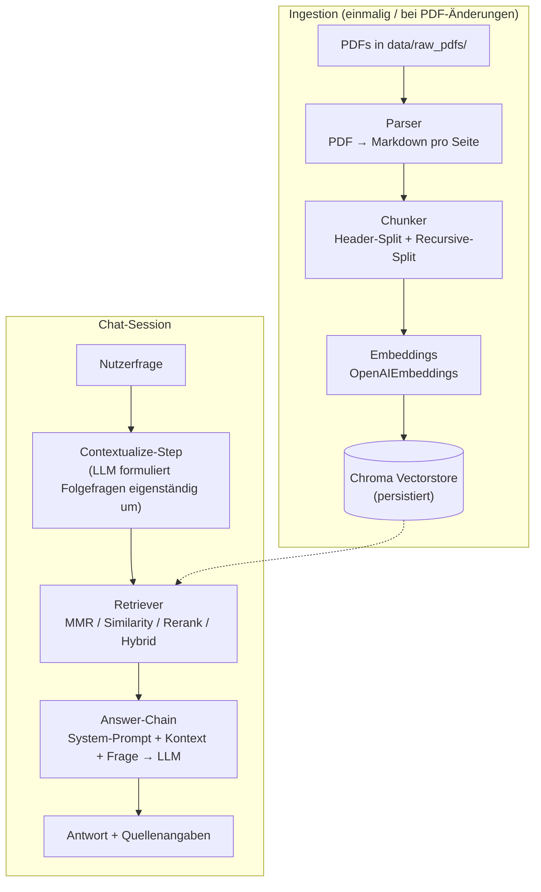

# Abaqus Handbuch-Chatbot — Projektpräsentation

**Ein Dokument für die Abgabe:** Aufbau des Systems, alle getesteten
Varianten, RAGAS-Metriken und das Gesamtergebnis. Für die technischen
Details der einzelnen Vergleiche siehe die verlinkten `docs/*.md`-Dateien;
für eine interaktive Version aller Zahlen siehe
[`docs/dashboard.html`](dashboard.html) (lokal im Browser öffnen).

---

## Inhalt

1. [Was das System tut](#1-was-das-system-tut)
2. [Architektur](#2-architektur)
3. [Untersuchte Varianten — Überblick](#3-untersuchte-varianten--überblick)
4. [Wie RAGAS bewertet: die fünf Metriken](#4-wie-ragas-bewertet-die-fünf-metriken)
5. [Ergebnisse je Vergleichsdimension](#5-ergebnisse-je-vergleichsdimension)
6. [Gesamtergebnis: was am besten abschneidet](#6-gesamtergebnis-was-am-besten-abschneidet)
7. [Reproduzierbarkeit](#7-reproduzierbarkeit)

---

## 1. Was das System tut

Der Chatbot beantwortet Fragen zur Bedienung der FEA-Software **Abaqus** auf
Basis der offiziellen PDF-Handbücher (~5.100 Seiten, 4 Dokumente) —
mit **seitengenauer Quellenangabe** (jede Antwort verweist auf die
Original-PDF-Seite) und **Gesprächsgedächtnis** für Folgefragen. Es handelt
sich um ein klassisches **Retrieval-Augmented-Generation (RAG)**-System: Der
Bot beantwortet Fragen ausschließlich auf Basis von Textabschnitten, die
zuvor aus den Handbüchern abgerufen wurden — nicht aus dem "Weltwissen" des
Sprachmodells. Das reduziert Halluzinationen und macht Antworten
nachprüfbar.

Über die reine Grundfunktion hinaus ist das Projekt so aufgebaut, dass
**jede Komponente der Pipeline austauschbar ist** — PDF-Parser, Chunking-
Strategie, Embedding-Modell, Retrieval-Strategie und Antwort-LLM sind
jeweils als Registry mehrerer Implementierungen realisiert. Das erlaubt es,
für jede Komponente empirisch zu prüfen, welche Variante die beste
Antwortqualität liefert — der Kern dieser Abgabe.

## 2. Architektur



Die Ingestion läuft einmalig (bzw. bei geänderten PDFs), die Chat-Session
greift nur lesend auf den fertigen Vectorstore zu. Zentrale Design-
entscheidungen:

| Bereich | Produktiv-Wahl | Begründung |
|---|---|---|
| Vektor-DB | [Chroma](https://www.trychroma.com/) (lokal, persistent) | Keine Server-Infrastruktur nötig, native LangChain-Integration, Metadaten-Filterung. |
| PDF-Parser | PyMuPDF4LLM | Wandelt PDFs seitenweise in Markdown um, erhält Überschriften/Tabellen/Seitenzahlen; ~0,02 s/Seite. |
| Chunking | Markdown-Header-Split + Recursive-Split (Hybrid) | Hält zusammengehörige Abschnitte zusammen; nur überlange Abschnitte werden zusätzlich zeichenbasiert gesplittet. |
| Embeddings | `text-embedding-3-small` | Guter Kompromiss aus Kosten und Retrieval-Qualität. |
| LLM | `gpt-4o-mini` (konfigurierbar) | Günstig, schnell, für Handbuch-Q&A ausreichend präzise. |
| RAG-Kette | reine [LCEL](https://python.langchain.com/docs/concepts/lcel/)-Runnables | LangChain ≥1.0 hat `langchain.chains` entfernt; Kette wird transparent aus Runnables zusammengesetzt statt über einen Compat-Layer. |
| Retrieval | MMR (Max Marginal Relevance), k=5 | Reduziert redundante Chunks aus derselben Seite/Sektion. |

Jede Zeile dieser Tabelle ist zugleich der **Produktiv-Default**, gegen den
in den folgenden Vergleichen jeweils eine Dimension isoliert variiert wird
(die übrigen bleiben fix) — so bleiben Effekte einzelnen Ursachen
zurechenbar statt sich in einer vollen Kombinatorik zu vermischen. Details
und alle Alternativen: [`docs/DOKUMENTATION.md`](DOKUMENTATION.md).

## 3. Untersuchte Varianten — Überblick

Sechs unabhängige RAGAS-Vergleichsstudien, alle auf demselben ~53-Seiten-
Demo-Korpus und demselben festen 12-Fragen-Set, mit demselben festen
OpenAI-Richter (siehe Abschnitt 4). Jede Studie variiert **nur ihre eigene
Dimension**, alle übrigen bleiben auf dem Produktiv-Default fixiert.

| # | Dimension | Getestete Varianten | Sieger dieser Studie | ⌀-Score | Doku |
|---|---|---|---|---|---|
| 1 | **PDF-Parser** | PyMuPDF4LLM, Docling, pdfplumber, Unstructured (4) | Unstructured + OpenAI | 0.785 | [`PARSER.md`](PARSER.md), [`EVALUATION.md`](EVALUATION.md) |
| 2 | **Chunking-Strategie** | Header+Recursive (400/800/1600), Recursive-only, Token-basiert, Semantic (6) | Semantic Chunking + OpenAI | 0.821 | [`CHUNKING.md`](CHUNKING.md) |
| 3 | **Embedding-Modell** | 3× OpenAI, 4× lokale HuggingFace-Modelle (7) | text-embedding-3-large + OpenAI | 0.820 | [`EMBEDDING.md`](EMBEDDING.md) |
| 4 | **Retrieval-Strategie** | MMR, Similarity, Cross-Encoder-Rerank, BM25-Hybrid (4) | Rerank + OpenAI | **0.863** | [`RETRIEVAL.md`](RETRIEVAL.md) |
| 5 | **Antwort-LLM** | OpenAI, Mistral, Qwen2.5-32B (3, kostenlos) | Qwen2.5-32B | 0.756 | [`LLM.md`](LLM.md) |
| 6 | **Best-of-Breed** | Kombination der vier Einzelsieger (1–4) vs. Produktiv-Baseline, je 3 LLMs (2×3) | Best-of-Breed | 0.847 ⌀ | [`BEST_OF_BREED.md`](BEST_OF_BREED.md) |

Zusammen: **51 Kombinationen × 12 Fragen × 5 Metriken = 3.060
Einzel-Scores, 0 Fehler, 0 fehlende Werte.** Jede Zelle wird in Abschnitt 5
weiter aufgeschlüsselt; das Gesamtfazit steht in Abschnitt 6.

## 4. Wie RAGAS bewertet: die fünf Metriken

[RAGAS](https://docs.ragas.io/) bewertet nicht die Antwort als Ganzes mit
einer einzigen Zahl, sondern zerlegt Qualität in **fünf unabhängige
Metriken**, die jeweils einen anderen Fehlermodus eines RAG-Systems
aufdecken. Alle Werte liegen in **[0, 1]**, höher ist besser. Für jede
Frage braucht RAGAS: die Nutzerfrage, die generierte Antwort, die
abgerufenen Kontext-Chunks und (für drei der fünf Metriken) eine manuell
verfasste **Referenzantwort** ("Ground Truth").

Damit die 51 Varianten untereinander fair vergleichbar sind, bewertet ein
**fester, unabhängiger Richter** (`gpt-4o-mini`, immer über OpenAI/Hub,
egal welches LLM die zu bewertende Antwort erzeugt hat) alle Instanzen.
Würde man stattdessen z. B. Mistral-Antworten von Mistral selbst bewerten
lassen, entstünde ein **Self-Preference-Bias** — LLMs bewerten eigene
Formulierungen tendenziell günstiger, was die Vergleichbarkeit zerstören
würde (`src/rag_manual_bot/eval/metrics.py`).

### Faithfulness — "Ist die Antwort durch den Kontext gedeckt?"

*Braucht keine Referenz.* Der Richter zerlegt die generierte Antwort in
einzelne, atomare Behauptungen ("Claims") und prüft für **jede** Behauptung
einzeln per Natural-Language-Inference, ob sie sich aus den abgerufenen
Kontext-Chunks logisch ableiten lässt.

> Faithfulness = (Anzahl durch den Kontext gedeckter Claims) / (Gesamtzahl der Claims in der Antwort)

Ein niedriger Wert heißt: Das Modell **halluziniert** — es behauptet Dinge,
die im abgerufenen Text so nicht stehen. Das ist die zentrale Metrik gegen
Falschinformation und im RAG-Kontext oft die wichtigste.

### AnswerRelevancy — "Beantwortet die Antwort die gestellte Frage?"

*Braucht keine Referenz.* Der Richter generiert aus der gegebenen Antwort
mehrere künstliche "Rückwärts-Fragen" (welche Frage würde zu genau dieser
Antwort passen?) und vergleicht deren Embeddings per Kosinus-Ähnlichkeit
mit dem Embedding der tatsächlich gestellten Frage.

> AnswerRelevancy = Ø Kosinus-Ähnlichkeit(Embedding(generierte Rückwärts-Frage), Embedding(Originalfrage))

Eine Antwort, die zwar faktisch korrekt, aber ausweichend, zu allgemein
oder mit irrelevanten Zusatzinformationen überladen ist, bekommt hier einen
niedrigen Wert — selbst wenn Faithfulness hoch ist.

### ContextPrecision — "Sind die abgerufenen Chunks relevant?"

*Braucht eine Referenzantwort.* Für **jeden einzelnen** abgerufenen Chunk
entscheidet der Richter, ob dieser zur Beantwortung im Sinne der
Referenzantwort beiträgt oder nicht (relevant/irrelevant). Aus dieser
Relevanz-Liste wird eine rangbasierte **Average Precision** berechnet, die
relevante Chunks an vorderer Position stärker gewichtet als solche am Ende
der Trefferliste.

> ContextPrecision = Ø Precision@k über alle Ränge k, gewichtet danach, ob Chunk k relevant ist

Ein niedriger Wert heißt: Das Retrieval liefert viel **Rauschen** — Chunks,
die zwar thematisch in der Nähe liegen, aber nicht wirklich zur Antwort
beitragen (verschwendet Kontext-Budget, kann das LLM ablenken).

### ContextRecall — "Deckt der Kontext alles ab, was nötig wäre?"

*Braucht eine Referenzantwort.* Der Richter zerlegt die **Referenzantwort**
(nicht die generierte Antwort) in einzelne Sätze/Aussagen und prüft für
jede einzeln, ob sie sich aus den abgerufenen Chunks belegen lässt.

> ContextRecall = (Anzahl der Referenz-Aussagen, die im Kontext belegbar sind) / (Gesamtzahl der Referenz-Aussagen)

Ein niedriger Wert heißt: Das Retrieval hat **etwas Wichtiges verpasst** —
Information, die für eine vollständige Antwort nötig gewesen wäre, wurde
gar nicht erst abgerufen. Anders als Faithfulness/AnswerRelevancy misst
das ausschließlich die **Retrieval**-Qualität, nicht das antwortende LLM —
deshalb sind ContextPrecision/ContextRecall in allen sechs Studien für
verschiedene LLMs bei sonst gleicher Pipeline identisch (gutes internes
Konsistenz-Signal).

### FactualCorrectness — "Wie viele Fakten stimmen mit der Referenz überein?"

*Braucht eine Referenzantwort.* Beide Texte — generierte Antwort und
Referenzantwort — werden vom Richter in atomare Fakten zerlegt. Für jedes
Faktenpaar wird geprüft, ob es logisch übereinstimmt; daraus ergeben sich
richtig-positive (in beiden), falsch-positive (nur in der Antwort) und
falsch-negative (nur in der Referenz) Fakten, aus denen ein **F1-Score**
(harmonisches Mittel aus Präzision und Recall der Fakten) berechnet wird.

> FactualCorrectness = F1(Fakten der generierten Antwort, Fakten der Referenzantwort)

Diese Metrik ist über alle 51 Varianten hinweg durchgängig die
**niedrigste** (typisch 0,4–0,7) — das ist für ein striktes atomares
Fakten-F1 gegen manuell formulierte Referenzantworten normal (unterschiedliche
Formulierung ≠ unterschiedlicher Inhalt, wird aber teilweise als Mismatch
gewertet) und sollte nicht direkt auf derselben Skala mit den anderen vier
Metriken verglichen werden.

### Zusammenfassend: welche Metrik deckt welchen Fehler auf?

| Metrik | Prüft | Typischer Fehler bei niedrigem Wert |
|---|---|---|
| Faithfulness | Antwort vs. Kontext | LLM halluziniert |
| AnswerRelevancy | Antwort vs. Frage | Antwort ist ausweichend/off-topic |
| ContextPrecision | Kontext vs. Referenz | Retrieval liefert Rauschen |
| ContextRecall | Kontext vs. Referenz | Retrieval verpasst wichtige Information |
| FactualCorrectness | Antwort vs. Referenz | Fakten stimmen nicht überein |

Der in dieser Abgabe durchgängig verwendete **⌀-Score** ist das ungewichtete
Mittel aller fünf Metriken pro Kombination — eine bewusst grobe
Gesamtkennzahl fürs Ranking; für Detailanalysen (z. B. "warum verliert
Docling") sind immer die Einzelmetriken aussagekräftiger, siehe die
Rohdaten-Tabellen in [`docs/dashboard.html`](dashboard.html).

## 5. Ergebnisse je Vergleichsdimension

Kurzfassung pro Studie — vollständige Tabellen, Diagramme und Einordnung in
den jeweils verlinkten Dokumenten bzw. im interaktiven Dashboard.

**Parser (1):** Unstructured (hi_res) gewinnt knapp vor dem Produktiv-Parser
PyMuPDF4LLM (0.785 vs. 0.763), Docling fällt deutlich ab (0.679/0.601 —
schlechteste ContextPrecision aller vier Parser, verliert Tabellenstruktur).
Da Unstructured ~160× langsamer ist und 1,8 GB zusätzliche Abhängigkeiten
braucht, bleibt PyMuPDF4LLM trotz des knappen zweiten Platzes die
pragmatische Produktiv-Wahl.

**Chunking (2):** Semantic Chunking gewinnt (0.821), knapp vor dem
Produktiv-Default Header+Recursive-800 (0.786 ⌀ für OpenAI). Auffällig: Die
größte ContextRecall aller Chunking-Varianten (0.958) — embedding-basierte
Breakpoints scheinen inhaltlich zusammengehörige Information seltener zu
zerreißen als feste Zeichengrenzen.

**Embedding (3):** `text-embedding-3-large` gewinnt (0.820), aber die
lokale, kostenlose Alternative `multilingual-e5-large` liefert die **höchste
ContextPrecision aller 21 in den Studien 1–4 getesteten Varianten (0.958)**
— ein Überraschungsfund: Ein lokal laufendes Open-Source-Modell schlägt
alle OpenAI-Embeddings bei diesem einen Teilaspekt, ohne API-Kosten.

**Retrieval (4):** Cross-Encoder-Rerank gewinnt **mit dem höchsten
Gesamtscore aller Einzelvergleiche** (0.863) und perfekter ContextRecall
(1.000) — der Reranking-Schritt nach dem initialen Retrieval verbessert die
Trefferqualität stärker als jede andere hier getestete Einzeländerung.

**Antwort-LLM (5):** Überraschend gewinnt das kostenlose Qwen2.5-32B
(0.756) vor OpenAI (0.748) und Mistral (0.713) — mit der besten
Faithfulness und FactualCorrectness aller drei Modelle, allerdings spürbar
langsamer pro Anfrage.

**Best-of-Breed (6):** Die Kombination aller vier Einzelsieger (Unstructured
+ Semantic Chunking + `text-embedding-3-large` + Rerank) schlägt die
Produktiv-Baseline bei **allen 5 Metriken, für alle 3 LLMs, ohne Ausnahme**
(⌀ 0.847 vs. 0.745, +13,7 %). Details und die wichtige Einschränkung dazu
in Abschnitt 6.

## 6. Gesamtergebnis: was am besten abschneidet

Die naheliegende Erwartung wäre: Wenn jede Einzeldimension isoliert
verbessert wird, sollte die **Kombination aller vier Verbesserungen** (das
Best-of-Breed-Experiment) das beste Gesamtergebnis liefern. Das wurde
gezielt geprüft — und **so einfach ist es nicht**:

| Konfiguration | ⌀-Score | Bemerkung |
|---|---|---|
| Produktiv-Baseline (alle Defaults) | 0.745 | Ausgangspunkt |
| **Retrieval: nur Rerank statt MMR** (sonst unverändert) | **0.863** | **Bester Einzelwert im gesamten Projekt** |
| Best-of-Breed (alle 4 Einzelsieger kombiniert) | 0.847 | Schlägt die Baseline klar, aber **nicht** die einfache Rerank-Änderung |

Die simple Änderung **einer einzigen Komponente** (Retrieval-Strategie:
Rerank statt MMR) übertrifft in dieser Stichprobe die aufwendigere
Kombination aus vier gleichzeitigen Änderungen. Naheliegendste Erklärung:
Unstructured (hi_res) — einer der vier "Einzelsieger" — erkennt auf dem
Demo-Korpus nur 40 von 53 Seiten als nicht-leer und verliert damit
Korpusabdeckung, die den Qualitätsgewinn der anderen drei Komponenten
teilweise wieder auffrisst (siehe [`BEST_OF_BREED.md`](BEST_OF_BREED.md)
für die vollständige Analyse). Das ist die zentrale methodische Lehre
dieses Projekts: **Einzelverbesserungen addieren sich nicht automatisch —
jede Kombination muss selbst gemessen werden**, statt aus Einzelergebnissen
extrapoliert zu werden.

**Praktische Empfehlung** für den produktiven Einsatz: Produktiv-Pipeline
(PyMuPDF4LLM + Header-Recursive-800 + `text-embedding-3-small`) beibehalten,
**Rerank statt MMR** als Retrieval-Strategie einsetzen, **Qwen2.5-32B**
statt `gpt-4o-mini` als Antwort-LLM (kostenlos, leicht besser) — der
größte Qualitätsgewinn bei geringstem Umbauaufwand, ohne die Kosten- und
Geschwindigkeitsnachteile von Unstructured/Semantic-Chunking in Kauf zu
nehmen.

**Einschränkung der Aussagekraft:** Alle sechs Studien laufen auf demselben
n=12-Fragen-Set über einen ~53-Seiten-Demo-Korpus — geeignet, um klare
Tendenzen sichtbar zu machen (z. B. den durchgängigen Docling-Rückstand),
aber nicht, um knappe Rangunterschiede (z. B. 0.820 vs. 0.821) als
statistisch abgesichert zu interpretieren. Für eine belastbarere Aussage
wären ein größeres Fragenset und/oder mehrere Wiederholungsläufe pro
Kombination nötig.

## 7. Reproduzierbarkeit

Alle Ergebnisse sind mit den Skripten im Repository nachvollziehbar
(Details je Studie in den verlinkten `docs/*.md`):

```bash
pip install -r requirements.txt -r requirements-eval.txt \
    -r requirements-parser-comparison.txt \
    -r requirements-chunking-comparison.txt \
    -r requirements-embedding-comparison.txt \
    -r requirements-retrieval-comparison.txt

python scripts/build_parser_demo_corpus.py
python scripts/build_chunking_demo_corpus.py
python scripts/build_embedding_demo_corpus.py
python scripts/build_best_of_breed_demo.py

python scripts/evaluate_ragas.py              # Parser × LLM
python scripts/evaluate_chunking_ragas.py     # Chunking × LLM
python scripts/evaluate_embedding_ragas.py    # Embedding × LLM
python scripts/evaluate_retrieval_ragas.py    # Retrieval × LLM
python scripts/evaluate_llm_ragas.py          # Antwort-LLM
python scripts/evaluate_best_of_breed.py      # Best-of-Breed vs. Baseline
```

Interaktiv im Browser (auch ohne alle obigen Schritte): Chat-Frontend
`streamlit run app.py` — die Sidebar erlaubt, jede der fünf Dimensionen
(Parser/Chunking/Embedding/Retrieval/LLM) live umzuschalten, sowohl auf dem
Demo- als auch auf dem vollen Produktiv-Korpus. Offline-Testsuite:
`python -m pytest tests/ -v`.
